# Dagster System Interactivity & Control Flow

This document describes the full control flow between the Dagster orchestration system, the local PostgreSQL database, and the Airtable workspace used by recruiters. It covers data ingestion, LLM normalization, human-in-the-loop feedback, matchmaking, and match lifecycle tracking.

---

## System Overview

---

## Airtable Table Structure

### Talent Table (`tblOkLOSo4Zjwp0yF`)

Contains candidate profiles submitted through forms, scouts, and community partners.

| Field Category | Examples |
|---|---|
| **Identity** | Full Name, Mail, Telegram Handle, Location |
| **Profile** | Professional Summary, CV (attachment), Proof of Work, LinkedIn, GitHub, X Profile |
| **Classification** | Talent Category, Experience Levels, Desired Job Category, Skills |
| **Recruiter Scoring** | Ranking (1-5), Overall Talent Rating, Highlight Talent |
| **Status** | Job Status: `Lead` · `Joined Talent Pool` · `Actively looking` · `In interview process` · `Hired` · `No interest` · `Unresponsive` · **`Fraud`** · `Recently Hired (not STT)` |
| **Normalized `(N)` fields** | (N) Full Name, (N) Skills Summary, (N) Professional Summary, (N) Seniority Level, (N) Years Of Experience, (N) Compensation Min/Max, (N) Verification Status (`unverified` / `verified`), etc. |
| **Matching Links** | Job Match (→ ATS), In Interview (→ ATS) |

### Customers STT Table (`tbl9KNjT3G08f6oXh`) — Jobs

Contains job postings from hiring companies.

| Field Category | Examples |
|---|---|
| **Company Info** | Company, Full Name, Mail, Website Link |
| **Job Details** | Job Description Link (Notion), Hiring Job Title, Work Setup Preference, Timezone |
| **Normalized `(N)` fields** | (N) Job Title, (N) Role Summary, (N) Must Have Skills, (N) Nice To Have Skills, (N) Seniority Level, (N) Salary Min/Max, (N) Narratives (Experience, Domain, Personality, Impact, Technical, Role), etc. |
| **Matchmaking Trigger** | **`Start Matchmaking`** (checkbox) — recruiter checks this to trigger the matchmaking pipeline |

### ATS Table (`tblrbhITEIBOxwcQV`) — Applicant Tracking

The recruiter's operational workspace for tracking candidates through the hiring funnel per job.

| Field | Type | Purpose |
|---|---|---|
| Open Position (Job Title) | text | Job title |
| Job Status | select | `Sourcing` · `Initial Recruiting` · `Ongoing Recruiting` · `Client Introduction` · `In Interview` · `Offer` · `Probation period` · `Hired` · `On Hold` · `Backlog` · `Position closed` · `Disqualified` |
| **Potential Talent Fit AI** | links → Talent | **Where AI match results are uploaded** |
| Recruiter AI Result Rejection | links → Talent | Recruiter rejects an AI-recommended match |
| Shortlisted Talent | links → Talent | Recruiter-approved candidates |
| Client Introduction | links → Talent | Candidates sent to the company |
| In Interview 1–4 | links → Talent | Interview rounds |
| Interview: Assignment | links → Talent | Take-home / assignment stage |
| In Negotiations | text | Negotiation stage |
| Hired | links → Talent | Successfully placed |
| Introduction Rejected | links → Talent | Rejected at introduction |
| Interview Rejected | links → Talent | Rejected during interviews |
| Assignment Rejected | links → Talent | Rejected at assignment |
| Negotiations Rejection | links → Talent | Rejected during negotiation |
| Talent Rejected Job | links → Talent | Candidate declined the job |
| Considered Talent (Job On Hold) | links → Talent | Parked when job goes on hold |
| Run AI Match Making Workflow | checkbox | Legacy trigger field |

---

## Data Flow: Candidate Pipeline

```mermaid
flowchart TD
    subgraph Ingestion["1. Ingestion"]
        A1[Airtable Candidate Sensor]
        A2["Poll every 15 min\n(cursor-based incremental sync)"]
        A3["Detect new/modified candidates\nvia LAST_MODIFIED_TIME()"]
        A1 --> A2 --> A3
    end

    subgraph Raw["2. Raw Storage"]
        B1["Fetch record from Airtable"]
        B2["Extract PDF text from CV\n(OpenRouter PDF engine)"]
        B3["Store in raw_candidates\n(cv_text + cv_text_pdf)"]
        B1 --> B2 --> B3
    end

    subgraph Norm["3. Normalization"]
        C1["Merge Airtable text + PDF text"]
        C2["LLM extracts structured data:\n• Skills (with ratings 1-10)\n• Experience history\n• Projects & hackathons\n• Soft attributes\n• Narratives"]
        C3["Store in normalized_candidates\n+ candidate_skills\n+ candidate_experiences\n+ candidate_projects\n+ candidate_attributes"]
        C1 --> C2 --> C3
    end

    subgraph Vec["4. Vectorization"]
        D1["Generate embeddings:\n• Narrative vectors (experience, domain,\n  personality, impact, technical)\n• Skill vectors (per skill)\n• Position vectors (per past job)\n• Project vectors (per project)"]
        D2["Store in candidate_vectors\n(pgvector)"]
        D1 --> D2
    end

    subgraph Fitness["5. Role Fitness"]
        E1["LLM scores candidate\nper desired job category (0-100)"]
        E2["Store in candidate_role_fitness"]
        E1 --> E2
    end

    subgraph Sync["6. Sync to Airtable"]
        F1["Map normalized fields\nto (N) column names"]
        F2["PATCH Airtable record\nwith (N) fields"]
        F1 --> F2
    end

    A3 -->|"RunRequest\n(partition = record_id)"| B1
    B3 --> C1
    C3 --> D1
    C3 --> E1
    C3 --> F1
```

---

## Data Flow: Job Pipeline

```mermaid
flowchart TD
    subgraph Ingestion["1. Job Ingestion"]
        A1["Fetch job record from Airtable\nCustomers STT table"]
        A2["Resolve job description:\n• Notion page → fetch & convert\n• Plain text → use directly"]
        A3["Store in raw_jobs"]
        A1 --> A2 --> A3
    end

    subgraph Norm["2. Normalization"]
        B1["LLM extracts structured requirements:\n• Role summary & responsibilities\n• Must-have / nice-to-have skills\n• Compensation, location, seniority\n• Narratives (experience, domain,\n  personality, impact, technical, role)"]
        B2["Store in normalized_jobs\n+ job_required_skills\n(with expected_capability per skill)"]
        A3 --> B1 --> B2
    end

    subgraph Vec["3. Vectorization"]
        C1["Generate embeddings:\n• Narrative vectors\n• Skill expected_capability vectors"]
        C2["Store in job_vectors\n(pgvector)"]
        B2 --> C1 --> C2
    end

    subgraph Sync["4. Sync to Airtable"]
        D1["Map normalized fields\nto (N) column names"]
        D2["PATCH Customers STT record\nwith (N) fields"]
        D3["Set Start Matchmaking = false"]
        C2 -.-> D1 --> D2 --> D3
    end
```

---

## Human-in-the-Loop: Job Feedback & Matchmaking Trigger

This is the core interactive loop where recruiters review and adjust LLM-normalized data before triggering matchmaking.

---

## Matchmaking Scoring Algorithm

---

## Match Lifecycle in ATS

**[TODO]** Upload matches to the ATS table's `Potential Talent Fit AI` column. After upload, the recruiter drives the match through the hiring funnel:

```mermaid
flowchart TD
    AI["🤖 Potential Talent Fit AI\n(Dagster uploads matches here)"]

    AI -->|Recruiter approves| SHORT["Shortlisted Talent"]
    AI -->|Recruiter rejects| REJ_AI["Recruiter AI Result Rejection"]

    SHORT --> INTRO["Client Introduction\n(sent to company)"]

    INTRO -->|Company interested| IV1["In Interview 1"]
    INTRO -->|Company rejects| REJ_INTRO["Introduction Rejected"]

    IV1 --> IV2["In Interview 2"]
    IV1 --> ASS["Interview: Assignment"]
    IV1 -->|Rejected| REJ_IV["Interview Rejected"]

    ASS -->|Pass| IV2
    ASS -->|Fail| REJ_ASS["Assignment Rejected"]

    IV2 --> IV3["In Interview 3"]
    IV3 --> IV4["In Interview 4"]

    IV4 --> NEG["In Negotiations"]
    IV2 --> NEG

    NEG -->|Deal reached| HIRED["✅ Hired"]
    NEG -->|Falls through| REJ_NEG["Negotiations Rejection"]

    IV1 -->|Candidate declines| REJ_SELF["Talent Rejected Job"]
    INTRO -->|Job paused| HOLD["Considered Talent\n(Job On Hold)"]

    style AI fill:#e8f4fd,stroke:#1a73e8
    style HIRED fill:#e6f4ea,stroke:#34a853
    style REJ_AI fill:#fce8e6,stroke:#ea4335
    style REJ_INTRO fill:#fce8e6,stroke:#ea4335
    style REJ_IV fill:#fce8e6,stroke:#ea4335
    style REJ_ASS fill:#fce8e6,stroke:#ea4335
    style REJ_NEG fill:#fce8e6,stroke:#ea4335
    style REJ_SELF fill:#fff3e0,stroke:#f9ab00
```

### Match Outcome Data Collection

**[TODO]** The outcome of each match (which stage it reached, whether it was rejected or hired) is valuable training data for improving the matchmaking algorithm. A future data-mining model can use this to:

- Adjust scoring weights based on historical accept/reject patterns
- Identify which vector dimensions best predict successful placements
- Detect systematic biases in the matching (e.g., over-valuing certain skills)

To enable this, we need a **match outcome sensor** that periodically reads the ATS table and records which `Potential Talent Fit AI` candidates moved to which stage, building a labeled dataset of `(candidate, job, outcome)` tuples.

---

## Candidate Fraud & Status Hooks

**[TODO]** Implement a sensor or hook that detects when a recruiter marks a candidate's `Job Status` as `Fraud` in the Talent table.

### Other Candidate Property Updates

Beyond fraud, recruiters may update other candidate properties that should flow back into the system:

| Airtable Field | Effect |
|---|---|
| `Job Status` → `Fraud` | Exclude from future matchmaking |
| `(N) Verification Status` → `verified` | **[TODO]** Boost match confidence / prioritize in results |
| `(N) Skills Summary` (edited) | **[TODO]** Trigger re-vectorization (similar to job feedback loop) |
| `Highlight Talent` (checkbox) | **[TODO]** Surface candidate prominently in match results |

---

## Complete System Flow — End to End

---

## Sensor Configuration Summary

| Sensor | Interval | Trigger | Job | Status |
|---|---|---|---|---|
| `airtable_candidate_sensor` | 15 min | New/modified candidate records | `candidate_pipeline_job` | Implemented |
| `airtable_job_matchmaking_sensor` | 5 min | `Start Matchmaking` checkbox = true | `matchmaking_with_feedback_job` | Implemented |
| Fraud detection sensor | TBD | `Job Status` = `Fraud` | Mark candidate excluded | **[TODO]** |
| Match outcome sensor | TBD | ATS column changes (talent moves between stages) | Record outcome data | **[TODO]** |
| Candidate feedback sensor | TBD | Recruiter edits `(N)` fields on Talent + triggers re-match | `candidate_revectorize_job` | **[TODO]** |

---

## Job Pipeline Variations

---

## TODO Summary

| # | Task | Priority | Description |
|---|---|---|---|
| 1 | **Upload matches to Airtable** | High | After matchmaking completes, write top matches to the ATS table's `Potential Talent Fit AI` column as linked Talent records |
| 2 | **Fraud detection sensor** | Medium | Detect `Job Status` = `Fraud` on Talent records and exclude those candidates from future matchmaking |
| 3 | **Match outcome sensor** | Medium | Periodically read ATS stage columns to build a labeled dataset of `(candidate, job, outcome)` for future model training |
| 4 | **Candidate feedback loop** | Low | Allow recruiters to edit `(N)` fields on Talent records and trigger re-vectorization + re-matching (mirror of job feedback loop) |
| 5 | **Verification status boost** | Low | Use `(N) Verification Status = verified` to boost match confidence or prioritize in results |
| 6 | **Highlight Talent surfacing** | Low | Surface `Highlight Talent` candidates more prominently in match results |
