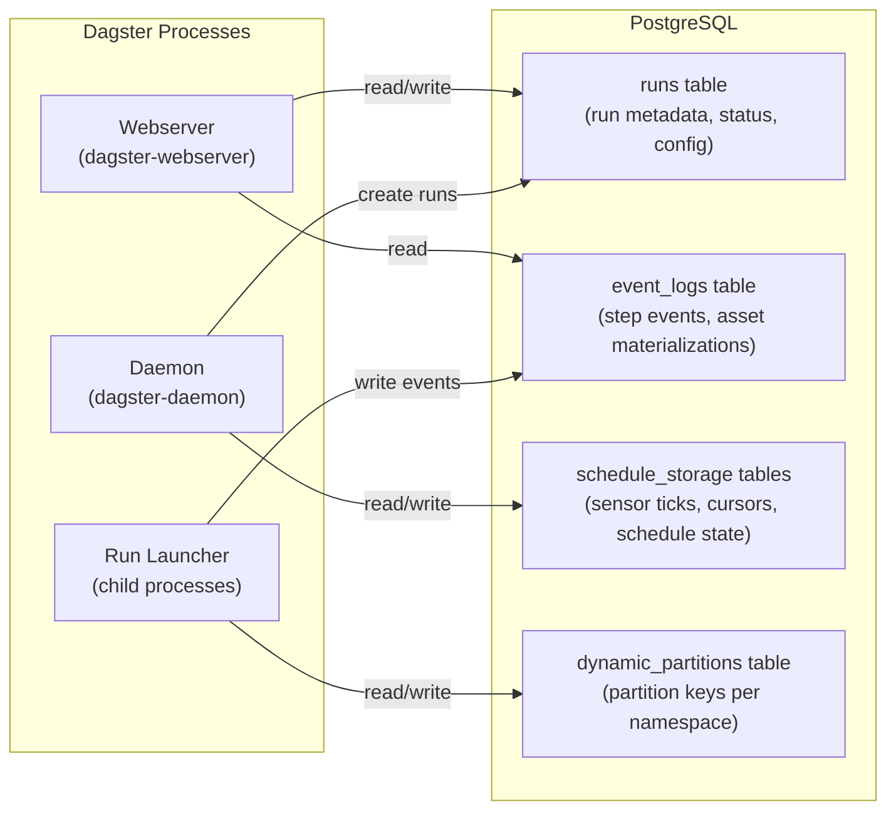
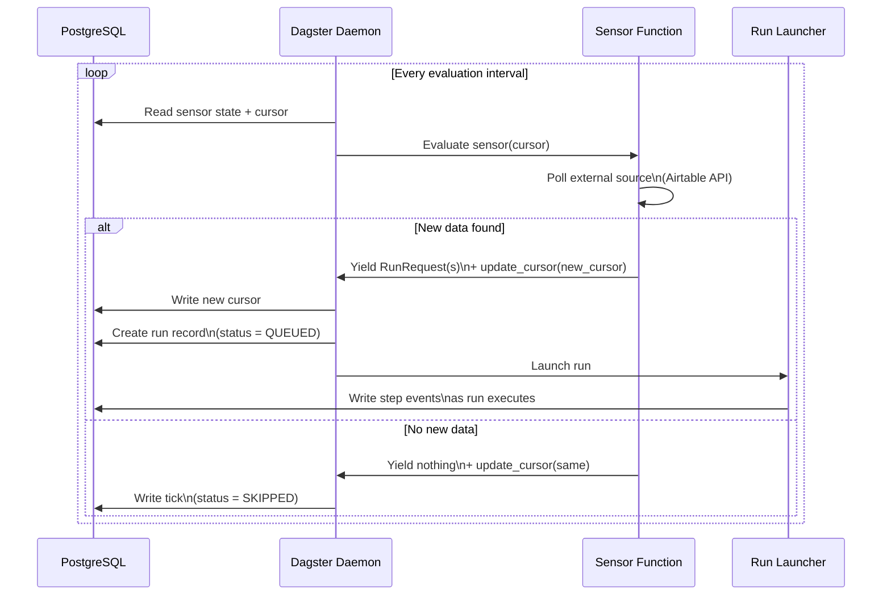
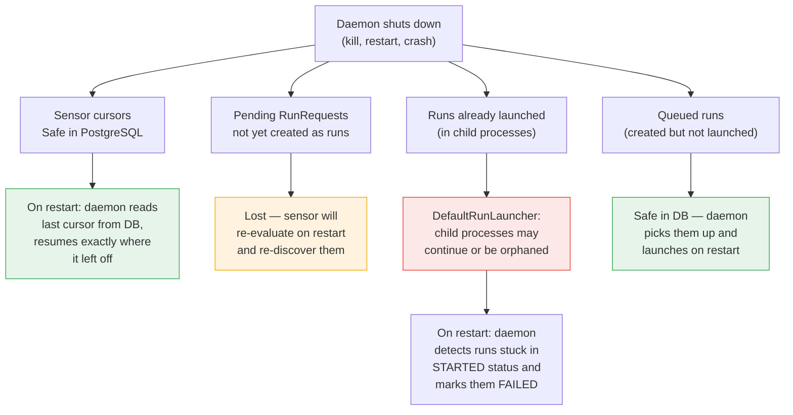
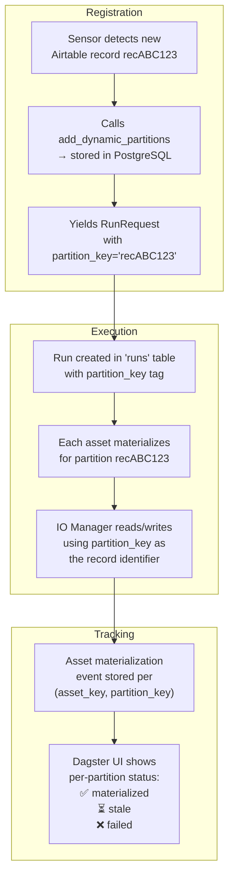
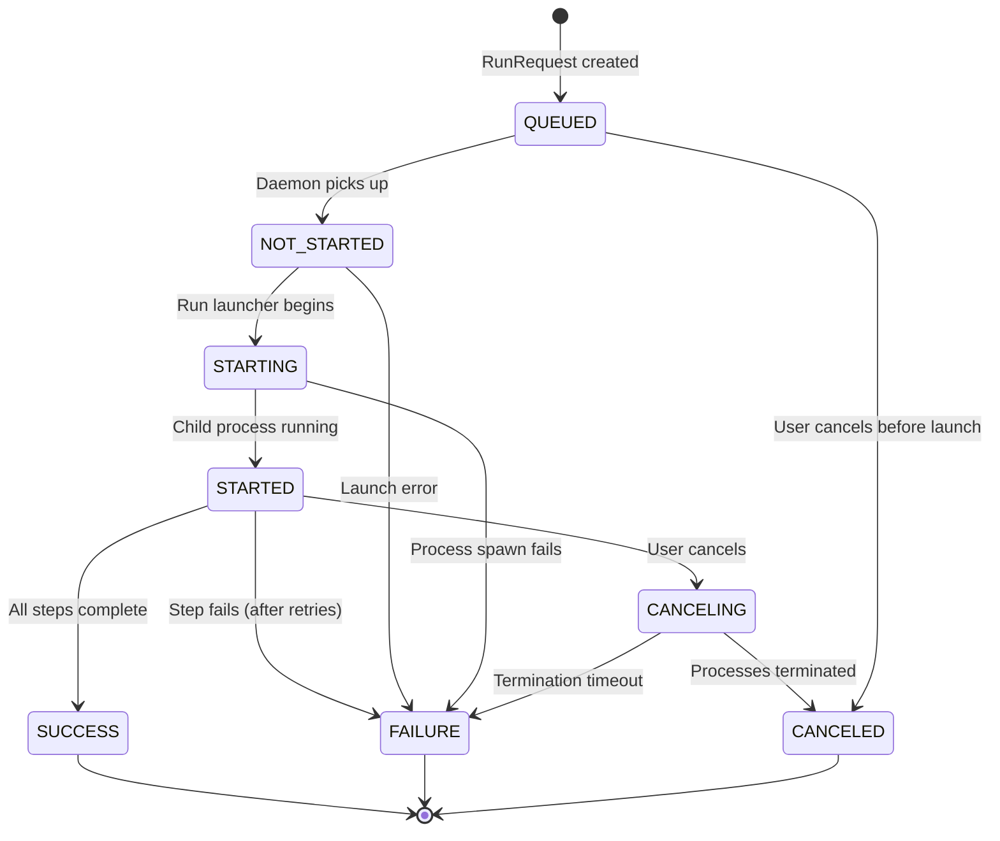
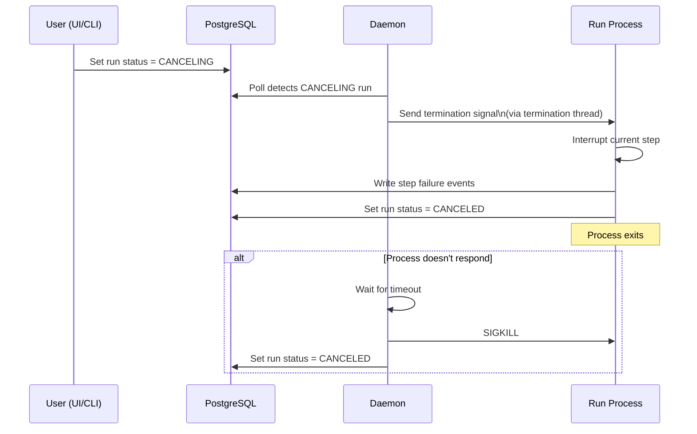
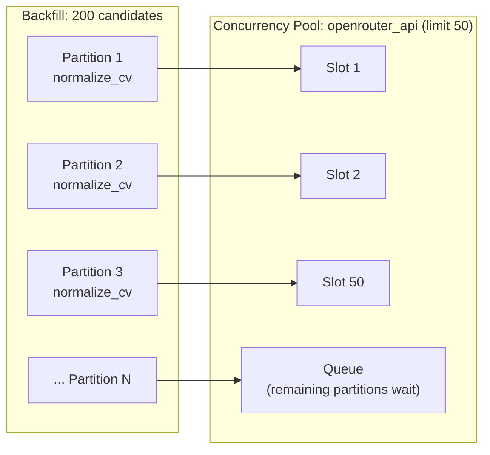

# Dagster Scheduling, Partitions & Cancellation

How runs are scheduled, partitions are tracked, and what happens when the Dagster daemon shuts down.

---

## Storage Architecture

All Dagster metadata is persisted in **PostgreSQL** (the same database as application data). Nothing lives in memory only.



### What each table stores

| PostgreSQL Table | Purpose | Survives daemon restart? |
|---|---|---|
| `runs` | Run metadata: status, job name, partition key, run config, timestamps, tags | Yes |
| `run_tags` | Key-value tags per run (for filtering in UI) | Yes |
| `event_logs` | Step-level events: start, success, failure, retries, asset materializations, metadata | Yes |
| `secondary_indexes` | Indexes on event logs for fast queries | Yes |
| `schedule_ticks` / `job_ticks` | Sensor/schedule evaluation history, tick status, error messages | Yes |
| `instigators` | Sensor/schedule definitions, their ON/OFF state, **cursors** | Yes |
| `dynamic_partitions` | Registered partition keys per namespace (`candidates`, `jobs`) | Yes |
| `asset_keys` | Known asset keys and their metadata | Yes |
| `bulk_actions` | Backfill metadata (which partitions, progress, status) | Yes |

Because everything is in PostgreSQL, **no state is lost when the daemon restarts**.

---

## How Sensor-Driven Scheduling Works

This project uses no cron schedules. All automation is event-driven via sensors.

### Sensor Lifecycle



### Sensor Cursor Persistence

Each sensor stores a **cursor** — a string (typically JSON) that tracks its progress. The cursor is written to PostgreSQL after every evaluation.

**`airtable_candidate_sensor`** (every 15 min):

```json
{
  "initialized": true,
  "last_sync": "2026-02-23T12:00:00.000Z"
}
```

On first run (`initialized: false`), it does a full sync of all Airtable record IDs. On subsequent runs, it uses `last_sync` to fetch only records modified since that timestamp via Airtable's `LAST_MODIFIED_TIME()` formula filter.

**`airtable_job_matchmaking_sensor`** (every 5 min):

No meaningful cursor — it polls for jobs with `Start Matchmaking = true` on every tick. Idempotent because it unchecks the flag after triggering.

### What happens when the daemon shuts down?



**Key guarantees:**

1. **Cursors are safe.** The sensor cursor is written to PostgreSQL after each tick. On restart, the daemon reads the last saved cursor and resumes. At worst, the sensor re-processes a few records that were fetched in the last tick but whose RunRequests weren't persisted yet. The pipeline handles duplicates gracefully (upserts).

2. **Queued runs are safe.** Runs that were created in the `runs` table (status `QUEUED` or `NOT_STARTED`) survive the restart. The daemon picks them up and launches them.

3. **In-flight runs may be lost.** With `DefaultRunLauncher` (local process), child processes are tied to the daemon's process tree. If the daemon is killed (`SIGKILL`), child processes may become orphaned. On restart, the daemon detects runs stuck in `STARTED` or `CANCELING` status and marks them `FAILURE` after a timeout.

4. **Backfills are safe.** Backfill progress (which partitions completed, which are pending) is tracked in the `bulk_actions` table. On restart, the daemon resumes submitting the remaining partitions.

---

## Dynamic Partitions

### How partitions are registered

Two partition namespaces exist:

| Namespace | Partition Key | Registered By |
|---|---|---|
| `candidates` | Airtable record ID (e.g., `recABC123`) | `airtable_candidate_sensor` or `sync_airtable_candidates_job` |
| `jobs` | Airtable job record ID (e.g., `recXYZ789`) | `sync_airtable_jobs_job` (manual) |

Registration happens via:

```python
context.instance.add_dynamic_partitions(
    partitions_def_name="candidates",
    partition_keys=["recABC123", "recDEF456"]
)
```

This inserts rows into the `dynamic_partitions` PostgreSQL table. Partition keys are permanent — they persist across daemon restarts and are never auto-deleted.

### How partitioned runs work



### Backfills

To re-process all candidates (e.g., after a prompt change), use **backfills** in the Dagster UI:

1. Go to the asset or job in the UI
2. Click "Materialize" or "Launch Backfill"
3. Select partition range (all, specific partitions, or a filter)
4. Dagster creates one run per partition (or batches them)

Backfill state is stored in `bulk_actions`:

| Field | Description |
|---|---|
| `backfill_id` | Unique identifier |
| `partition_names` | List of partitions to process |
| `status` | `REQUESTED` → `COMPLETED` / `FAILED` / `CANCELED` |
| `num_partitions` | Total count |
| `num_cancelable` | Remaining partitions that can be canceled |

The daemon submits partitions in batches and tracks progress. If the daemon restarts mid-backfill, it reads the `bulk_actions` table and resumes with the remaining partitions.

---

## Run Lifecycle & Cancellation

### Run Status State Machine



All status transitions are written to the `runs` table in PostgreSQL.

### How cancellation works



The `DefaultRunLauncher` uses local subprocesses, so cancellation sends OS signals (`SIGINT` → `SIGKILL`). Each subprocess has a **termination thread** that monitors a shared event and triggers cleanup.

### Retry policies

API-heavy jobs use exponential backoff retries:

```
Max retries: 3
Delay: 1s base
Backoff: EXPONENTIAL (1s → 2s → 4s)
Jitter: PLUS_MINUS (randomized to avoid thundering herd)
```

Applied to: `candidate_pipeline_job`, `job_pipeline_job`, `matchmaking_with_feedback_job`

Retries happen **within the same run** — no new run is created. Each retry attempt is logged as a separate event in the event log. After exhausting retries, the step fails and the run status depends on whether other steps can continue.

---

## Concurrency Control

### How concurrency pools work

```yaml
# dagster.yaml
concurrency:
  pools:
    default_limit: 50
```

Assets are tagged with concurrency keys:

| Concurrency Key | Assets | Purpose |
|---|---|---|
| `airtable_api` | `airtable_candidates`, `airtable_jobs`, `airtable_candidate_sync`, `airtable_job_sync` | Prevent Airtable rate limiting |
| `openrouter_api` | `normalized_candidates`, `normalized_jobs`, `candidate_vectors`, `job_vectors`, `candidate_role_fitness` | Prevent OpenRouter rate limiting |

When multiple partitions run concurrently (e.g., during a backfill), Dagster ensures no more than 50 ops with the same concurrency key execute simultaneously. Excess ops are **queued** (not rejected) and execute as slots free up.



---

## Summary: What survives a daemon restart?

| State | Persisted in PostgreSQL? | Behavior on restart |
|---|---|---|
| Sensor cursors | Yes (`instigators` table) | Resume from last cursor |
| Sensor ON/OFF state | Yes (`instigators` table) | Sensors stay in same state |
| Registered partitions | Yes (`dynamic_partitions` table) | All partitions preserved |
| Queued runs | Yes (`runs` table) | Launched by daemon |
| In-flight runs | Yes (status in `runs`) | Detected as stuck → marked `FAILURE` |
| Backfill progress | Yes (`bulk_actions` table) | Remaining partitions submitted |
| Run history & logs | Yes (`runs` + `event_logs`) | Fully queryable |
| Concurrency slot usage | Ephemeral | Recomputed from active runs |
| Pending RunRequests (from sensor yield, not yet persisted) | No | Sensor re-evaluates and re-discovers |
