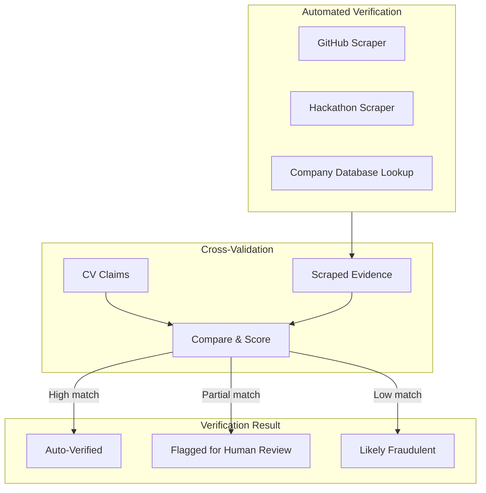
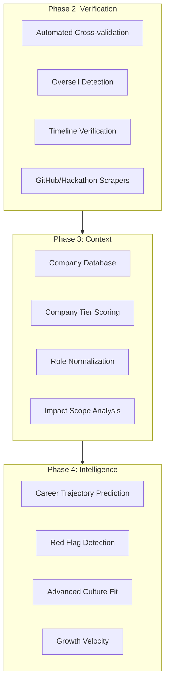
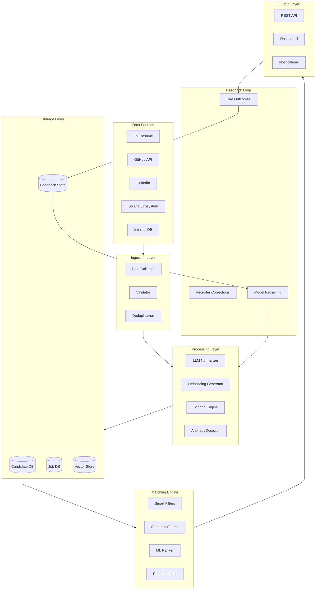
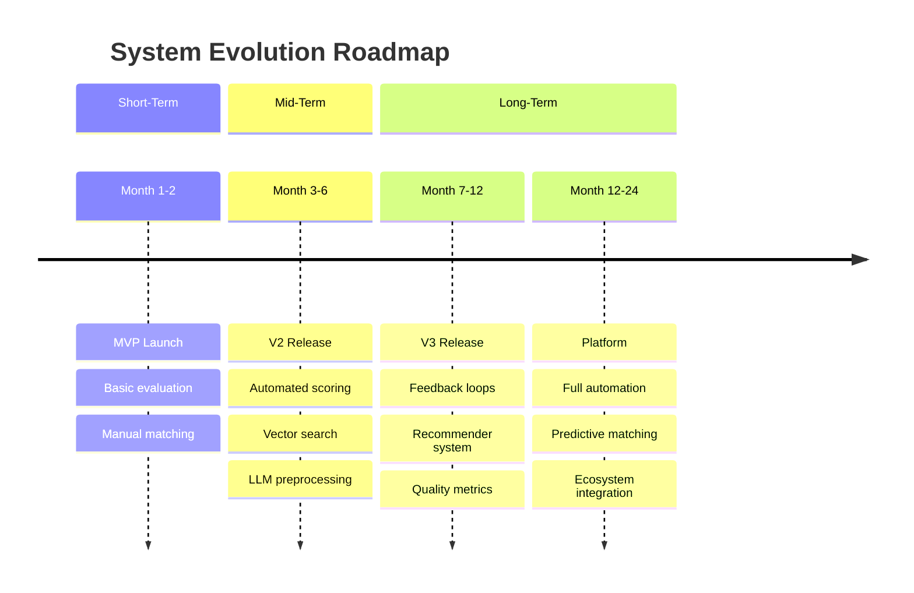

# Long-Term Vision: Talent Evaluation & Matchmaking Platform

| Capability | Long-Term Enhancement | Phase |
| --- | --- | --- |
| **Skill Scoring** | OSS contribution significance → Code quality analysis → Originality detection | Phase 2-4 |
| **Deep CV Analysis** | Automated verification → Company tier adjustment → Career trajectory prediction | Phase 2-4 |
| **Matching** | Recommender system with feedback loops | Phase 2-4 |
| **Verification** | Replace human review with automated scraping + cross-validation + oversell detection | Phase 2 |
| **Company Database** | Build comprehensive company tier system → Role normalization → Engineering quality scoring | Phase 3 |
| **Intelligence** | Static scores → Learning from hire outcomes → Predictive matching (success, retention) | Phase 3-4 |

---

## Executive Overview

### From MVP to Platform

The MVP establishes a foundation with LLM-based normalization, dual storage (metrics + vectors), and instant hybrid matching. The long-term vision transforms this into an **intelligent talent platform** that verifies claims, understands context, learns from outcomes, and provides increasingly accurate predictions over time.

### Evolution Beyond MVP

```mermaid
flowchart LR
    subgraph mvp [MVP Foundation]
        direction TB
        M1[LLM Normalization]
        M2[Dual Storage]
        M3[Hybrid Matching]
        M4[Human Verification]
    end

    subgraph phase2 [Phase 2: Verification]
        direction TB
        P2A[Universal Skill Scoring]
        P2B[Automated Cross-validation]
        P2C[Oversell Detection]
        P2D[OSS Significance]
    end

    subgraph phase3 [Phase 3: Context]
        direction TB
        P3A[Company Database System]
        P3B[Company Tier Evaluation]
        P3C[LLM Code Quality]
        P3D[Role Normalization]
    end

    subgraph phase4 [Phase 4: Intelligence]
        direction TB
        P4A[Feedback Loops]
        P4B[Recommender System]
        P4C[Predictive Matching]
    end

    mvp --> phase2
    phase2 --> phase3
    phase3 --> phase4
```



### Key Improvements Beyond MVP

| Capability | MVP State | Long-Term State |
| --- | --- | --- |
| **Skill Scoring** | Commits, repos, stars (quantity) | Code quality analysis, originality detection (quality) |
| **CV Analysis** | LLM normalization & basic scoring | Oversell detection, company tier adjustment, career trajectory |
| **Job Pipeline** | LLM normalization, instant matching | Context-aware matching, historical success patterns |
| **Matching** | Filter + semantic search | Recommender system with feedback loops, predictive matching |
| **Learning** | Static scoring | Continuous improvement from hire outcomes |
| **Verification** | Human review at end of pipeline | Automated scraping + cross-validation |

---

## Vision Statement

**The North Star:**
An intelligent talent matching platform that **verifies** candidate claims automatically, **understands context** across company tiers, **learns** from every hire, and **predicts** success with minimal human effort.

**Key Outcomes:**
1. **Verified, not just claimed** (Phase 2) — Every candidate claim is automatically cross-validated against external evidence, with automated oversell/undersell detection
2. **Context-aware scoring** (Phase 3) — Seniority and skill levels normalized across company tiers and role definitions using a comprehensive company database
3. **Self-improving accuracy** (Phase 3-4) — Match quality improves over time as the system learns from hiring outcomes
4. **Predictive matching** (Phase 4) — System predicts not just fit, but success probability, retention likelihood, and career trajectory

---

## Evaluation System Evolution

### Advanced Signals Beyond MVP

**MVP Baseline:** Quantitative GitHub metrics (commits, repos, stars, years), basic LLM normalization, basic vectorization

**Future Signal Opportunities:**

- **OSS contribution significance** → Weight contributions to high-impact repos, distinguish code vs docs, track PR merge rates
- **Code quality analysis** → Architecture sophistication, best practices, problem-solving via LLM review
- **Originality scoring** → Detect copied vs original solutions, plagiarism detection
- **Systems-level skills** → Distinguish junior vs senior based on architecture complexity
- **Career narratives** → LLM-generated summaries of career trajectory and growth velocity

**Signal Evolution Roadmap:**

| Phase | New Signals | Source | Complexity |
| --- | --- | --- | --- |
| Phase 2 | OSS contribution significance, claim verification, oversell detection | GitHub API + Analysis + Scraping | Medium |
| Phase 3 | LLM code quality scoring, company tier context, role normalization | Code analysis + Company database | High |
| Phase 4 | Originality detection, architecture complexity, career trajectory prediction | Deep analysis + ML models | Advanced |

---

### Skill Scoring Evolution

**MVP Baseline: Simple Quantitative Metrics**

> Simple, quantitative metrics that can be extracted via GitHub API with minimal complexity.
> 

**MVP Metrics:**

| Metric | How to Extract | Reasoning |
| --- | --- | --- |
| Total commits | GitHub API | Raw coding experience (can be gamed though) |
| Number of repos | GitHub API | Count public repos, weight by activity (gameable) |
| Years of activity | First commit date | More years = higher experience signal |
| Primary languages | Repo language stats | Match against job requirements |
| Stars received | GitHub API | Indicator of project quality/visibility (likely gameable) |

**Relative GitHub Score Formula (MVP):**

> Score candidates relative to the entire applicant pool using percentile rankings.
> 

```
For each candidate:
1. Calculate raw metrics (commits, repos, years_active, stars)
2. Compute percentile rank for each metric across all candidates
3. Combine percentiles:

github_score = w1 * percentile(commits, all_candidates)
             + w2 * percentile(repos, all_candidates)
             + w3 * percentile(years_active, all_candidates)
             + w4 * percentile(stars, all_candidates)
             + language_match_bonus

Result: Score from 0-100 showing relative standing in applicant pool
```

### Phase 2: OSS Contribution Significance

Move beyond raw commit counts to understand *where* contributions are made:

| Enhancement | Description | Implementation |
| --- | --- | --- |
| Significant repo detection | Weight contributions to high-star/high-fork repos higher | Match against curated list of significant projects OR use star/fork thresholds |
| Contribution type | Distinguish code commits vs docs vs issues | Analyze commit content and PR metadata |
| Merge rate | % of PRs that get merged in external repos | GitHub API for PR status |
| Maintainer recognition | Are they added as collaborators? | Check collaborator status on repos they don’t own |

**Phase 2 → Phase 3: LLM Code Quality Analysis**

Use LLMs to analyze actual code quality:

| Analysis Type | What It Measures | Approach |
| --- | --- | --- |
| Code complexity | Architecture sophistication, abstraction usage | LLM reviews sample repos/commits |
| Best practices | Testing, documentation, error handling | Pattern detection via LLM |
| Problem-solving | Algorithmic thinking, optimization | LLM evaluates solutions |
| Code style | Consistency, readability, maintainability | LLM scoring with rubric |

**Phase 3 → Phase 4: Advanced Analysis**

| Capability | Description | Complexity |
| --- | --- | --- |
| Originality scoring | Detect copied vs original solutions | Compare against known patterns, detect plagiarism |
| Architecture complexity | Junior vs senior level detection | Analyze system design patterns in repos |
| Cross-repo learning | Track growth over time | Compare code quality across time periods |
| Domain expertise | Identify specialized knowledge | Detect domain-specific patterns (crypto, ML, etc.) |

**GitHub Scoring Evolution Diagram:**

```mermaid
flowchart LR
    subgraph mvp [Phase 1: MVP]
        Commits[Commit Count]
        Repos[Repo Count]
        Stars[Star Count]
        Years[Years Active]
    end

    subgraph mid [Phase 2: Significance]
        OSS[OSS Contribution Weight]
        MergeRate[Merge Rate]
        RepoQuality[Target Repo Quality]
    end

    subgraph advanced [Phase 3: Quality]
        LLMReview[LLM Code Review]
        BestPractices[Best Practice Score]
        Complexity[Complexity Analysis]
    end

    subgraph expert [Phase 4: Deep Analysis]
        Originality[Originality Detection]
        Architecture[Architecture Patterns]
        Growth[Growth Trajectory]
    end

    mvp --> mid
    mid --> advanced
    advanced --> expert
```



---

### CV Analysis Evolution

> **MVP Baseline:** LLM normalization to JSON, dual storage (metrics + vectors), human verification
> 

### Phase 2: Universal Skill Taxonomy Scoring

> **Deferred from MVP:** Move beyond keyword matching to detailed 1-5 skill proficiency scoring.
> 

**Why Defer to Phase 2:**

- MVP focuses on simpler keyword + vector matching (faster to implement)
- Skill scoring adds complexity and LLM cost per candidate
- Need to validate matching approach works before adding sophistication

**Universal Skill Taxonomy Approach:**

Score candidates **once at ingestion** against a fixed, domain-relevant skill taxonomy. This avoids the combinatorial explosion of scoring every candidate × every job (O(n×m)) and reduces it to a single LLM call per candidate (O(n)). Matching against specific jobs then becomes a simple SQL lookup over pre-computed scores.

**Technical Skills (rate 1–5 each):**

| Category | Skills to Score | Why Included |
| --- | --- | --- |
| **Languages** | Rust, TypeScript/JavaScript, Python, Solidity, Go, C/C++ | Core languages in Solana ecosystem and adjacent roles |
| **Blockchain / Web3** | Solana (Anchor, SPL), Ethereum/EVM, smart contracts, DeFi protocols, NFT standards, cross-chain/bridges | Domain-specific expertise for Superteam roles |
| **Backend** | System design, databases, APIs/REST/gRPC, distributed systems | General backend engineering competency |
| **Frontend** | React, Next.js, wallet integrations, dApp UX | Full-stack and frontend roles |
| **Infrastructure** | DevOps/CI-CD, cloud (AWS/GCP), monitoring, security | Operational maturity signal |

*Meta-Competencies (rate 1–5 each):*

- **Technical Depth:** Specialist vs. generalist breadth
- **Seniority Level:** 1=Junior, 3=Mid, 5=Senior/Lead
- **Growth Trajectory:** Career progression and ambition signals
- **Open Source / Community:** OSS contributions, community involvement
- **Solana Ecosystem Familiarity:** Hackathons, ecosystem projects, Superteam activity

**Scoring Prompt Template:**

```
You are evaluating a developer candidate. Score them on each skill and competency from 1-5 based on their profile. Do NOT compare against a specific job — score their absolute ability level.

Candidate Profile:
{normalized_cv_json}

Score each skill (1=no experience, 2=beginner, 3=competent, 4=advanced, 5=expert):

Technical Skills:
- rust, typescript, python, solidity, go, c_cpp
- solana, ethereum, smart_contracts, defi, nft, cross_chain
- system_design, databases, apis, distributed_systems
- react, nextjs, wallet_integrations, dapp_ux
- devops, cloud, monitoring, security

Meta-Competencies (1-5):
- technical_depth, seniority_level, growth_trajectory
- open_source_community, solana_ecosystem

Output as JSON:
{
  "skills": {
    "rust": {"score": X, "evidence": "..."},
    "typescript": {"score": X, "evidence": "..."},
    ...
  },
  "meta": {
    "technical_depth": {"score": X, "reason": "..."},
    "seniority_level": {"score": X, "reason": "..."},
    "growth_trajectory": {"score": X, "reason": "..."},
    "open_source_community": {"score": X, "reason": "..."},
    "solana_ecosystem": {"score": X, "reason": "..."},
  },
  "summary": "2-3 sentence evaluation"
}

If there is no evidence for a skill, score 0 and note "no evidence".
```

**How Matching Works With Pre-Computed Scores:**

At match time, the job's normalized `must_have_skills` and `nice_to_have_skills` simply **look up** the candidate's pre-computed skill scores. No additional LLM call needed — it's a weighted SQL query.

```sql
-- Example: matching for a Senior Rust/Solana DeFi role
SELECT candidate_id,
  (skill_scores->>'rust')::int * 0.3 +          -- must-have, high weight
  (skill_scores->>'solana')::int * 0.25 +        -- must-have
  (skill_scores->>'defi')::int * 0.2 +           -- must-have
  (skill_scores->>'typescript')::int * 0.1 +     -- nice-to-have
  (meta_scores->>'seniority_level')::int * 0.15  -- seniority fit
  AS match_score
FROM candidates
WHERE (skill_scores->>'rust')::int >= 3          -- hard filter: min competent
  AND (skill_scores->>'solana')::int >= 2         -- hard filter
  AND verification_status != 'fraudulent'
ORDER BY match_score DESC
LIMIT 50;
```

**Cost Impact:**

| Approach | LLM Calls | Scales As |
| --- | --- | --- |
| Score per candidate × per job | n × m calls | O(n×m) — combinatorial explosion |
| Score once at ingestion | n calls (once) | O(n) — matching is free SQL queries |

**Building & Maintaining the Taxonomy:**

- Start with ~20 skills derived from your most common job descriptions
- **Version the taxonomy** just like prompts — when you add new skills, only re-score candidates on the new dimensions
- Review and expand quarterly based on incoming job requirements

### Phase 2: Automated Verification + Oversell/Undersell Detection

> Move from human verification to automated scraping and cross-validation.
> 

**Automated Verification (Replaces Human Review):**

| Source | Verification Method | Implementation Complexity |
| --- | --- | --- |
| **GitHub** | Scrape profile, verify commits/repos match claims | Medium (GitHub API is stable) |
| **Hackathons** | Scrape results pages (Devpost, Solana hackathons) | High (pages vary, change often) |
| **LinkedIn** | API integration or scraping | High (anti-bot, API costs) |
| **Company verification** | Cross-reference with company databases | Medium (need data source) |

**Verification Pipeline:**



**Verification Score:**

```
verification_score =
    w1 * github_match_score +
    w2 * hackathon_match_score +
    w3 * company_match_score

# Thresholds:
# > 0.8 = Auto-verified
# 0.5-0.8 = Human review
# < 0.5 = Likely fraudulent
```

**Oversell/Undersell Detection (Built on Verification):**

> Compare what candidates claim vs what we can substantiate.
> 

| Detection Type | Description | Implementation |
| --- | --- | --- |
| GitHub cross-validation | Do claimed skills match GitHub activity? | Compare CV skills vs GitHub languages/repos |
| Timeline verification | Do dates/durations make sense? | Check for overlapping roles, unrealistic claims |
| Title inflation | Is “Lead” actually a lead? | Analyze team size, responsibilities in description |
| Skill depth vs breadth | Many skills listed but shallow experience? | LLM analysis of experience descriptions |

**Oversell/Undersell Scoring Prompt (Draft):**

```
You are analyzing a candidate for potential overselling or underselling.

CV Claims:
{normalized_cv_json}

External Evidence:
- GitHub: {github_summary}
- Hackathons: {hackathon_data}
- References: {reference_notes}

For each major claim in the CV, assess:
1. Is there supporting evidence? (verified/unverified/contradicted)
2. Does the claim seem inflated, accurate, or understated?

Output:
{
  "claims_analysis": [
    {
      "claim": "...",
      "evidence": "...",
      "verdict": "verified|unverified|inflated|understated",
      "confidence": 0.0-1.0
    }
  ],
  "overall_credibility_score": 1-5,
  "red_flags": ["..."],
  "positive_signals": ["..."]
}
```

**Phase 3: Company & Role Quality Scoring**

> Not all experience is equal — "Senior at unknown startup" ≠ "Senior at Google"
> 

### Automated Company Analysis via LLM Scraping

> Instead of building a heavy company database upfront, use LLMs to scrape and analyze companies on-demand as they appear in candidate CVs.
> 

**How It Works:**

1. **Trigger:** When processing a candidate CV, extract company names from work experience
2. **Scrape:** For each new/stale company, scrape:
    - Company website (About, Team, Press pages)
    - Twitter/X (company account, recent announcements)
    - Google search results (funding announcements, tech news)
    - Crunchbase/similar APIs (if available)
3. **LLM Analysis:** Pass scraped content to LLM to fill out company profile
4. **Cache:** Store results in database with timestamp to avoid re-scraping

**Company Data Model (LLM-Populated):**

```
Company
├── company_id (UUID)
├── name (string)
├── website (string)
├── industry (string)
│
├── # Core Metadata (from scraping)
├── employee_count_estimate (string)        # e.g., "50-100", "500+"
├── founded_year (int)
├── headquarters_location (string)
├── funding_stage (enum)                    # bootstrapped|seed|series_a|b|c|d+|public
├── total_funding_estimate (string)         # e.g., "$5M-10M", "$100M+"
├── last_funding_date (date)                # From news/Crunchbase
│
├── # LLM-Derived Scores
├── company_tier (enum: tier1|tier2|tier3|tier4)
├── tech_reputation_score (float 1-5)
├── engineering_quality_estimate (float 1-5)
├── growth_stage (enum: early|growth|mature|declining)
│
├── # Context
├── primary_tech_stack (string[])
├── domain_focus (string[])                 # e.g., ["DeFi", "Infrastructure"]
├── notable_products (string[])
├── engineering_org_size_estimate (string)  # e.g., "10-20", "100+"
│
├── # LLM Analysis Summary
├── llm_summary (text)                      # 2-3 sentence company summary
├── reputation_reasoning (text)             # Why this tier/score?
│
└── metadata
    ├── scraped_sources (string[])          # URLs scraped
    ├── last_scraped (timestamp)
    ├── scrape_quality_score (float)        # How complete was the data?
    ├── needs_manual_review (bool)          # Flag uncertain cases
    └── created_at
```

**LLM Company Analysis Prompt (Draft):**

```
You are analyzing a company to determine its tier, reputation, and context for evaluating candidate experience.

Company Name: {company_name}

Scraped Data:
- Website content: {website_text}
- Recent Twitter posts: {twitter_content}
- Google search results: {search_results}
- Crunchbase data: {crunchbase_data}

Analyze this company and provide:

1. Company Tier (1-4):
   - Tier 1: FAANG, major tech (Google, Meta, Microsoft, etc.)
   - Tier 2: Well-funded startups (Series B+), known tech companies
   - Tier 3: Early-stage startups (Seed-A), lesser-known companies
   - Tier 4: Non-tech companies, very early stage, freelance

2. Tech Reputation Score (1-5): Engineering quality and standards
3. Growth Stage: early|growth|mature|declining
4. Funding Stage: bootstrapped|seed|series_a|series_b|series_c|series_d_plus|public
5. Employee Count Estimate: e.g., "10-50", "100-500", "1000+"
6. Engineering Org Size Estimate: e.g., "5-10", "50-100", "500+"
7. Primary Tech Stack: Languages/frameworks they use
8. Domain Focus: Main areas (DeFi, Infrastructure, Consumer, etc.)
9. Notable Products: Key products or achievements
10. Last Funding Info: Amount and date if found

Output as JSON:
{
  "company_tier": 1-4,
  "tier_reasoning": "Why this tier?",
  "tech_reputation_score": 1.0-5.0,
  "reputation_reasoning": "Why this score?",
  "growth_stage": "...",
  "funding_stage": "...",
  "total_funding_estimate": "...",
  "last_funding_date": "YYYY-MM-DD or null",
  "employee_count_estimate": "...",
  "engineering_org_size_estimate": "...",
  "primary_tech_stack": [...],
  "domain_focus": [...],
  "notable_products": [...],
  "llm_summary": "2-3 sentence company summary",
  "confidence_score": 0.0-1.0,
  "needs_manual_review": true/false
}

If data is insufficient, indicate low confidence and flag for manual review.
```

**Scraping Strategy:**

| Source | What to Extract | Fallback if Unavailable |
| --- | --- | --- |
| **Company Website** | About page, team size, tech stack, products | Use search results + Twitter |
| **Twitter/X** | Recent announcements, funding news, growth signals | Optional, skip if not found |
| **Google Search** | News articles, press releases, funding announcements | Always available |
| **Crunchbase API** | Structured funding data, employee count | Use free tier or scrape if API unavailable |

**Caching & Freshness:**

- **Cache for 3-6 months** — company tiers don't change rapidly
- **Refresh triggers:**
    - Manual refresh request
    - Funding announcement detected in news
    - Low confidence score on initial scrape
- **Cost optimization:** Only scrape companies that appear in actual candidate CVs

**Company Tier Definitions:**

```
Tier 1: FAANG, major tech companies (Google, Meta, Microsoft, Amazon, Apple, etc.)
        - High engineering bar, rigorous interview process
        - "Senior" means 5-7+ years, multiple projects, demonstrated impact
        - Strong brand recognition, attracts top talent

Tier 2: Well-funded startups (Series B+), successful mid-size tech companies
        - Known in tech circles, solid engineering reputation
        - "Senior" means 4-6+ years, technical leadership
        - Examples: Stripe, Airbnb, Notion, established crypto projects

Tier 3: Early-stage startups (Seed-Series A), lesser-known companies, agencies
        - Variable engineering quality, less established processes
        - "Senior" title may be inflated (3-4 years experience)
        - Higher variance in what "Senior" actually means

Tier 4: Non-tech companies, freelance, consulting, very early stage
        - Tech is not core business or very nascent team
        - Titles often inflated, less rigorous standards
        - "Senior" may mean 2-3 years or just solo developer

Role Level Adjustment Formula:
Tier 1 Senior ≈ Tier 2 Senior/Staff ≈ Tier 3 Lead ≈ Tier 4 Principal
```

**Role Normalization Using Company Context:**

| Factor | Description | How Used in Scoring |
| --- | --- | --- |
| Company tier | Quality/reputation of employer | Adjust seniority level: Tier 1 Senior = higher weight than Tier 3 Senior |
| Role title normalization | "Senior" at different companies means different things | Use tier + responsibilities to normalize to standard levels (L3-L7 equivalent) |
| Team size context | Leading 2 people vs 20 people | Adjust leadership/impact scores based on scope |
| Impact scope | Individual contributor vs org-wide impact | LLM analysis of achievements relative to company size |
| Engineering org maturity | 100-person eng org vs 5-person eng team | Context for understanding technical complexity and process maturity |

**Advantages of LLM Scraping Approach:**

- ✅ **Simpler to build** — no manual curation or data pipeline maintenance
- ✅ **Always fresh** — scrapes at analysis time, gets current funding info
- ✅ **Universal coverage** — works for any company, even obscure ones
- ✅ **Organic growth** — database builds naturally from actual candidate pool
- ✅ **Lower upfront cost** — no need to seed with hundreds of companies

**Tradeoffs:**

- ⚠️ **Latency** — adds 10-30 seconds per new company during candidate processing
- ⚠️ **Cost** — LLM calls per company (mitigated by caching)
- ⚠️ **Reliability** — web scraping can break, LLMs may hallucinate
- ⚠️ **Depth** — harder to get nuanced info like internal leveling systems

> **Note:** For very high-frequency companies (e.g., top 50 employers in your ecosystem), you can still manually enrich entries with deeper context if automated scraping proves insufficient.
> 

### Alternative Approaches to Company Analysis

> **Note:** The LLM scraping approach above is the recommended starting point, but here are alternative strategies if your needs differ:
> 

**Option 1: Manual Curation (High Quality, High Effort)**

Build a comprehensive, manually curated company database upfront:

- **When to use:** You have a narrow, well-defined ecosystem (e.g., only Solana companies) and want maximum accuracy
- **Approach:** Manually research and score top 200-500 companies in your target market
- **Pros:** Highest quality data, deep context, can include insider knowledge about engineering culture
- **Cons:** Requires significant upfront investment (weeks of work), becomes stale quickly, doesn't scale to long-tail companies
- **Data sources:** Crunchbase API, LinkedIn, [levels.fyi](http://levels.fyi), personal network knowledge, tech news aggregation
- **Maintenance:** Quarterly reviews, dedicated person/team to keep data fresh

**Option 2: API-Only Approach (Structured Data, Lower Context)**

Relying primarily on structured data APIs without LLM analysis:

- **When to use:** You want reliable, structured data and are okay with less nuanced tier/reputation scoring
- **Approach:** Pull from Crunchbase, LinkedIn Company API, Clearbit, etc. Use simple rules for tier assignment (e.g., funding stage + employee count)
- **Pros:** More reliable than scraping, structured data is easier to work with, lower LLM costs
- **Cons:** Expensive (API costs), misses nuance (a well-known startup might be Tier 2 despite being Seed stage), doesn't capture reputation well
- **Tier assignment rules:**
    - Tier 1: Public companies with >10K employees OR known FAANG list
    - Tier 2: Series B+ with >100 employees OR well-known brands
    - Tier 3: Series A/B or <100 employees
    - Tier 4: Earlier stage or non-tech companies

**Option 3: Hybrid Manual + LLM Scraping**

Manually curate top 50-100 companies, use LLM scraping for the long tail:

- **When to use:** Most of your candidates come from a small set of known companies, but you occasionally see outliers
- **Approach:** Hand-curate your ecosystem's top employers with deep research, fall back to automated scraping for unknowns
- **Pros:** Best of both worlds—high quality for common cases, universal coverage for edge cases
- **Cons:** Still requires upfront investment, need to maintain two systems
- **Implementation:** Check manual database first (instant lookup), trigger scraping only for cache misses

**Option 4: Crowdsourced/Community Scoring**

Leverage your recruiter network or community to score companies:

- **When to use:** You have an active recruiter community who knows the market well
- **Approach:** Build a lightweight UI where recruiters can quickly score companies they encounter (1-5 tier, quick notes)
- **Pros:** Insider knowledge, stays current through distributed effort, builds community engagement
- **Cons:** Requires active user base, subjective/inconsistent, slow to bootstrap
- **Quality control:** Show consensus scores, flag outliers, require minimum number of ratings

**Option 5: No Company Database (Simplest)**

Skip company context entirely in early phases:

- **When to use:** MVP stage, want to validate the core matching works before adding complexity
- **Approach:** Treat all experience equally, focus on skills and years of experience only
- **Pros:** Simplest to build, no external dependencies, no data staleness issues
- **Cons:** "Senior at unknown startup" gets same weight as "Senior at Google", less accurate matching
- **Migration path:** Easy to add company context later once you have user traction

**Recommendation:**

For most teams, start with **Option 5** (no company database) in your true MVP, then move to the **LLM scraping approach** (described above) in Phase 2-3 once you've validated core product-market fit. If you're in a very specific niche with <500 relevant companies, consider **Option 3** (hybrid manual + LLM) instead.

The LLM scraping approach hits the sweet spot of universal coverage, reasonable quality, and manageable implementation effort—without requiring weeks of manual curation or expensive API contracts.

---

**Phase 4: Advanced CV Intelligence**

| Capability | Description | Complexity |
| --- | --- | --- |
| Career trajectory prediction | Where is this person heading? | ML model on career paths |
| Red flag detection | Job hopping, gaps, inconsistencies | Pattern analysis across CVs |
| Culture/team fit signals | Work style, communication patterns | NLP on CV writing style |
| Growth velocity | How fast are they leveling up? | Time-between-promotions analysis |

**CV Analysis Evolution Diagram:**



**Enhanced CV Data Model (Phase 2+):**

> **Note:** MVP already implements dual storage (raw metrics + vectors). These are the **additional fields** for future phases.
> 

```
CandidateProfile
├── raw_cv (text)
├── normalized_profile (JSON)
│
├── # NEW METRICS (Phase 2+)
├── github_metrics (additions to MVP)
│   ├── significant_contributions (int)      # Phase 2
│   ├── pr_merge_rate (float)                # Phase 2
│   ├── maintainer_status (bool)             # Phase 2
│   └── code_quality_score (float)           # Phase 3
├── cv_metrics (additions to MVP)
│   ├── company_tiers (int[])                # Phase 3
│   └── role_normalized_level (int)          # Phase 3
├── # ADVANCED ANALYSIS (Phase 2+)
├── credibility
│   ├── oversell_undersell_score (float)
│   ├── verified_claims (JSON[])
│   ├── red_flags (string[])
│   └── cross_validation_results (JSON)
├── context
│   ├── company_tier_adjusted_score (float)
│   ├── normalized_seniority (int)
│   └── career_trajectory_prediction (string)
│
└── metadata
    ├── created_at
    ├── updated_at
    ├── source
    └── processing_version
```

**Enhanced Query Flow (Phase 3+):**

```
┌─────────────────────────────────────────────────────────────┐
│              CONTEXT-AWARE QUERY FLOW                       │
├─────────────────────────────────────────────────────────────┤
│                                                             │
│  1. HARD FILTERS (Raw Metrics) — MVP                        │
│     WHERE years_of_experience >= 3                          │
│       AND 'Rust' = ANY(skills)                              │
│                                                             │
│  2. VERIFICATION FILTER (Phase 2) — NEW                     │
│     AND verification_status != 'fraudulent'                 │
│     AND oversell_score < 0.3                                │
│                                                             │
│  3. CONTEXT-AWARE SCORING (Phase 3) — NEW                   │
│     Adjust scores based on company tier                     │
│     Normalize seniority levels                              │
│                                                             │
│  4. SEMANTIC RANKING (Vectors) — MVP                        │
│     ORDER BY cosine_similarity(profile_vector, job_vector)  │
│                                                             │
│  5. LEARNING-BASED RE-RANKING (Phase 4) — NEW               │
│     Apply ML model trained on hire outcomes                 │
│     Predict success probability                             │
│                                                             │
└─────────────────────────────────────────────────────────────┘
```

---

### ML/AI Integration

The system leverages AI/ML throughout the platform to improve matching quality and automate evaluation:

**Core AI/ML Capabilities:**

| Capability | Purpose | Phase |
| --- | --- | --- |
| **LLM Normalization** | Standardize CVs and job descriptions into structured formats | MVP |
| **Semantic Embeddings** | Generate vector representations for similarity-based matching | MVP |
| **Skill Extraction** | Identify and score technical skills from unstructured text | Phase 2 |
| **Anomaly Detection** | Flag inconsistencies and potential overselling in profiles | Phase 2 |
| **Predictive Modeling** | Train models on hire outcomes to predict match success | Phase 4 |

**Continuous Improvement via Feedback Loops:**

The system collects feedback from multiple sources to improve over time:

- **Hire outcomes** — Which matches led to successful hires?
- **Retention data** — Did the hire stay beyond 6/12 months?
- **Recruiter ratings** — How relevant were the matches?
- **Interview progression** — Which candidates advanced to final rounds?

This feedback is used to:

1. Refine matching weights and scoring algorithms
2. Train ML models to predict hire success probability
3. Identify which signals (GitHub activity, company tier, etc.) are most predictive
4. Personalize recommendations based on recruiter preferences

---

### Building the Company Database

**Phase 1: Seed with Top Companies (Months 1-3)**

- Manually curate top 200-500 companies in target ecosystem (Solana, crypto, tech)
- Assign tiers, reputation scores based on industry knowledge
- Pull basic data from Crunchbase

**Phase 2: Expand Coverage (Months 3-6)**

- Add companies as they appear in candidate CVs
- Automate data pulls from Crunchbase/LinkedIn
- Build workflow for quick company additions

**Phase 3: Automated Enrichment (Months 6-12)**

- Scrape funding announcements, tech news
- Track company growth metrics over time
- Update reputation scores based on hiring trends, product launches

---

## Matchmaking Evolution

> **MVP Baseline:** LLM job normalization, hybrid matching (40% keyword + 60% vector similarity), instant top-50 results
> 

### Phase 2: Enriched Job Context

| Enhancement | Description | Implementation |
| --- | --- | --- |
| Company tier integration | Factor in company quality when matching | Use company tier database |
| Role normalization | “Senior” at startup vs “Senior” at FAANG | Adjust match weights by context |
| Historical success patterns | What worked for similar roles before? | Analyze past successful hires |
| Salary/market alignment | Match candidates to compensation range | Integrate salary data |

**Phase 3: Learning-Based Matching**

| Capability | Description |
| --- | --- |
| Match quality feedback | Recruiters rate match quality → system learns |
| Hire outcome tracking | Did the match lead to hire? Retention? |
| Personalized recruiter preferences | Learn what each recruiter values |
| Proactive suggestions | “New candidate matches 3 open roles” |

**Phase 4: Predictive Matching**

| Capability | Description |
| --- | --- |
| Success prediction | “85% likely to be a good hire” |
| Retention prediction | “High risk of leaving within 1 year” |
| Growth prediction | “Likely to be promoted in 18 months” |
| Team fit scoring | Complement existing team strengths/gaps |

---

### Recommender System Approach

> Transform from query-based matching to a true recommender system.
> 

**From your notes:**
- Keep records and improve hit rates as a recommender system
- “Vibe matching” via soft skill vectors
- Distance search to find candidates who have done similar work before

**Recommender Evolution:**

| Stage | Approach | Key Improvement |  |
| --- | --- | --- | --- |
| MVP | Rule-based + semantic search | Fast, interpretable matches |  |
| Phase 2-3 | Weighted scoring with context | Company tier and verification adjustments |  |
| Phase 3-4 | Learning-based ranking | Learn from hire outcomes and recruiter feedback |  |
| Phase 4+ | Predictive modeling | Forecast success probability and retention risk |  |

### Scalability Architecture

> [TODO: How does the system handle 10x, 100x growth?]
> 

**Scaling Challenges:**
- [ ] [TODO: Challenge 1 and solution]
- [ ] [TODO: Challenge 2 and solution]
- [ ] [TODO: Challenge 3 and solution]

**Infrastructure Evolution:**

| Component | MVP | Scale | Enterprise |
| --- | --- | --- | --- |
| Database | [TODO] | [TODO] | [TODO] |
| Vector Store | [TODO] | [TODO] | [TODO] |
| Processing | [TODO] | [TODO] | [TODO] |
| API | [TODO] | [TODO] | [TODO] |

### Quality Metrics

> [TODO: How do you measure and maintain matching quality at scale?]
> 

**Key Quality Indicators:**

| Metric | Definition | Target | Current |
| --- | --- | --- | --- |
| Match Precision | [TODO] | [TODO] | ? |
| Time to Hire | [TODO] | [TODO] | ? |
| Candidate Satisfaction | [TODO] | [TODO] | ? |
| Recruiter Efficiency | [TODO] | [TODO] | ? |
| False Positive Rate | [TODO] | [TODO] | ? |

---

## Platform Integration

> [TODO: How does evaluation/matchmaking fit into a broader workflow?]
> 

### Upstream Integrations

| System | Data Received | Trigger |
| --- | --- | --- |
| [TODO: e.g., ATS] | [TODO] | [TODO] |
| [TODO: e.g., LinkedIn] | [TODO] | [TODO] |
| [TODO: e.g., GitHub] | [TODO] | [TODO] |

### Downstream Integrations

| System | Data Sent | Trigger |
| --- | --- | --- |
| [TODO: e.g., CRM] | [TODO] | [TODO] |
| [TODO: e.g., Calendar] | [TODO] | [TODO] |
| [TODO: e.g., Slack] | [TODO] | [TODO] |

### Workflow Position

> [TODO: Where does this system sit in the overall talent pipeline?]
> 

```
[TODO: Describe the end-to-end flow]

Sourcing → Intake → EVALUATION → MATCHING → Interview → Offer → Onboarding
                    ^^^^^^^^^^^   ^^^^^^^^^
                    (This System)
```

---

## Technical Architecture

> [TODO: Customize this diagram to show the long-term system design]
> 



---

## Evolution Roadmap

> [TODO: Map out the journey from MVP to full vision]
> 



---

## Open Questions

> [TODO: Things to explore, validate, or discuss further]
> 

### Technical Questions

- [ ]  [TODO: Question about architecture]
- [ ]  [TODO: Question about data]
- [ ]  [TODO: Question about ML approach]

### Business Questions

- [ ]  [TODO: Question about priorities]
- [ ]  [TODO: Question about resources]
- [ ]  [TODO: Question about success metrics]

### Research Needed

- [ ]  [TODO: Area to investigate]
- [ ]  [TODO: Benchmark to review]
- [ ]  [TODO: Technology to evaluate]

**From your notes — open questions to explore:**
- How do you detect systems-level skills? Size of architecture and complexity?
- How do you distinguish junior vs senior level skills?
- How do you quantize a story?
- Does standardized document length/structure work best for vectors?
- Should you chunk vectorization by project/experience/job?

---

## Risks & Long-Term Considerations

| Risk | Mitigation Strategy |
| --- | --- |
| Data quality degrades at scale | [TODO] |
| ML models drift over time | [TODO] |
| Privacy/compliance requirements | [TODO] |
| Bias in evaluation/matching | [TODO] |
| [TODO: Other risks] | [TODO] |

---

## Investment Required

> [TODO: What resources are needed to achieve the vision?]
> 

### Team

| Role | When Needed | Full-time/Part-time |
| --- | --- | --- |
| [TODO] | [TODO] | [TODO] |
| [TODO] | [TODO] | [TODO] |

### Infrastructure

| Component | Cost Range | When Needed |
| --- | --- | --- |
| [TODO] | [TODO] | [TODO] |
| [TODO] | [TODO] | [TODO] |

### Timeline

| Milestone | Target Date | Dependencies |
| --- | --- | --- |
| [TODO] | [TODO] | [TODO] |
| [TODO] | [TODO] | [TODO] |

---

## Your Additional Notes

> [TODO: Add any other long-term thoughts or ideas here]
> 
- 
- 
-