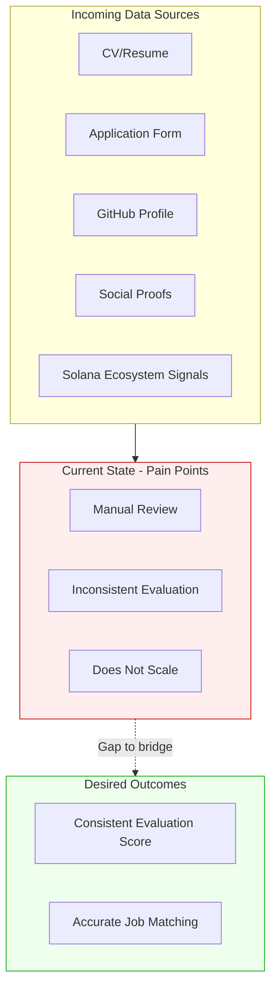

# Problem Analysis: Talent Evaluation & Matchmaking System

## Context Summary

**Company:** Superteam Talent

**Domain:** Solana ecosystem developer matching

**Scale:** Thousands of developers

**The Challenge:**

Turn diverse, inconsistent profile signals into:
1. A consistent evaluation system that runs automatically for every incoming candidate
2. A scalable matchmaking layer that maps evaluated talent to skill requirements

---

## Core Problems Identified

- **Problem 1: Inconsistent Manual Evaluation at Scale** — Current processes rely on manual, subjective evaluation of diverse signals (CVs, GitHub, hackathons, references). This produces inconsistent results and doesn't scale to thousands of developers. *Estimated time: ~15-30 min per candidate manually vs target of <1 min automated.*
- **Problem 2: Signal Inconsistency & Lack of Normalization** — Candidates present information in multiple different formats. CVs vary in structure, candidates may oversell or undersell themselves, and skills are often claimed without substantiation. No standard format makes comparison difficult.
- **Problem 3: No Automated Verification System** — Claims need cross-validation against external evidence (GitHub profiles, hackathon results, LinkedIn), but this is currently manual or not done at all. No systematic way to detect fraudulent or inflated credentials.
- **Problem 4: Missing Context for Fair Comparison** — "Senior Engineer at unknown startup" ≠ "Senior Engineer at Google". No normalization across company tiers, team sizes, or role definitions leads to unfair & subjective comparisons. Not only applicants, but also companies need to be analyzed and rated.
- **Problem 5: Long Time-to-Shortlist** — Going from thousands of candidates to a human-reviewable shortlist takes hours or days with manual filtering. No instant matching capability based on job requirements.
- **Problem 6: Dual Storage Challenge** — Need both precise filtering ("5+ years experience with Rust") AND semantic search ("find similar candidates"). Vectors alone are "mushy" — can't query precisely on them. Raw metrics alone miss semantic similarity and freedom to also find non-optimal but still promising matches.

---

## Data Quality Challenges

### Signal Inconsistency

**How different candidates present information differently:**

- **CV format diversity:** PDFs, DOCX, plain text, structured vs narrative styles, varying levels of detail
- **Overselling vs underselling:** Some candidates inflate titles ("Lead" with no team), others undersell achievements
- **Unsubstantiated claims:** Skills listed without proof of usage ("Expert in Rust" but no Rust repos)
- **GitHub activity mismatch:** CV claims don't match actual GitHub languages or contribution patterns
- **Narrative vs data:** Experience described as stories rather than quantifiable metrics
- **Timeline inconsistencies:** Overlapping roles, gaps, unrealistic durations

**Impact:** Without normalization, comparing candidates is subjective and inconsistent. LLM-based normalization to structured JSON format is the MVP solution.

### Signal Gaps

**Important information that's missing or hard to obtain:**

- **Code quality** — Commit counts don't reflect whether code is good, original, or copied from Stack Overflow
- **OSS contribution significance** — Contributing to a top-100 GitHub project ≠ contributing to personal repos, but raw metrics treat them the same
- **Company tier context** — No database of company reputation/quality to normalize experience levels
- **Architecture complexity** — Hard to detect systems-level skills and distinguish junior vs senior architecture experience from text alone
- **Team size & impact scope** — Leading 2 people vs 20 people; individual contributor vs org-wide impact
- **Verification evidence** — No automated way to confirm hackathon wins, employment history, or education credentials
- **Career trajectory** — No signal for growth velocity, promotion cadence, or future potential
- **Moral/values alignment** — Do candidates and companies share values? Hard to quantify from current data

### Signal Noise

**Data that's present but potentially misleading:**

- **Commit count inflation** — Automated commits, trivial changes, or daily "update README" commits inflate numbers without reflecting real work
- **Star count gaming** — Repos can have high stars but be low-quality or copied projects
- **Title inflation** — "Senior," "Lead," "Principal" titles vary wildly across companies and may not reflect actual seniority
- **Skills keyword stuffing** — CVs listing 50+ technologies to pass keyword filters, regardless of actual depth
- **Buzzword density** — Overuse of trendy terms ("AI-driven," "blockchain-native") without substance
- **Hackathon participation without wins** — Attending many hackathons isn't the same as winning them
- **Resume length bias** — Longer CVs aren't necessarily better; may indicate poor communication skills
- **Recency bias** — Recent activity weighted too heavily; senior developers may have less public GitHub activity

---

## Evaluation Challenges

### Consistency

**Why it's hard to evaluate candidates consistently:**

**Root cause:** Diverse input formats + subjective interpretation + no standard rubric = inconsistent evaluations.

**Specific challenges:**

- **Quantizing narratives:** CVs tell stories ("Led team through complex migration") but stories don't map to numeric scores without interpretation
- **Systems-level skill detection:** Architecture complexity and systems thinking are hard to detect from text — requires analyzing repo structure, not just keywords
- **Junior vs Senior distinction:** Beyond years of experience, need to assess scope of impact, technical depth, and leadership — all subjective without clear thresholds
- **Evaluator variance:** Different reviewers weight different signals differently (one values hackathons, another values Big Tech experience)

**MVP Solution:** LLM-based scoring with explicit rubrics (1-5 scales) for technical depth, experience relevance, seniority level, and growth trajectory. Provides consistent evaluation framework, though still learning-based rather than rule-based.

### Weighting

**How should different signals be weighted?**

**Signal hierarchy (preliminary):**

1. **Hackathon/grant wins (especially Solana ecosystem)** — High-confidence positive signal; demonstrates real execution
2. **Verified GitHub activity** — More reliable than self-reported skills, but needs quality assessment
3. **Years of experience + role complexity** — Strong seniority signal when contextualized by company tier
4. **Skills match** — Must-have vs nice-to-have; substantiated (in GitHub) vs claimed
5. **Education credentials** — Baseline signal; less predictive than work experience

**Open questions:**
- Hard skills (exact keyword matches) vs soft skills (vector similarity for "vibes") — how to balance?
- GitHub originality (original solutions) vs copied code — need Phase 3+ analysis to detect
- Company tier adjustment factor — how much should "Senior at Google" outweigh "Senior at unknown startup"?

- Team leadership signals — how to distinguish people managers from technical leads?

**MVP approach:** Simple weighted sum with adjustable coefficients. Long-term: ML-based weighting that learns from hire outcomes.

### Subjectivity

**What aspects require human judgment vs can be automated:**

**Automatable (MVP & beyond):**

- CV parsing and normalization to structured format (LLM)
- GitHub metrics extraction (API calls)
- Basic scoring on defined rubrics (LLM with prompts)
- Semantic similarity matching (vector search)
- Hard requirement filtering (SQL queries)
- Oversell/undersell detection (Phase 2: LLM cross-validation)
- Code quality analysis (Phase 3: LLM code review)

**Requires human judgment (MVP):**

- **Final hire decision** — Automated system suggests; humans decide
- **Claim verification** — MVP uses manual verification (clicking GitHub profiles, searching hackathon results). Automated scraping deferred due to brittleness.
- **Edge case evaluation** — Unusual career paths, non-traditional backgrounds
- **Culture/team fit** — Personality, communication style, values alignment
- **Fraud detection final call** — System can flag suspicious; humans confirm
- **Scoring rubric design** — Humans define what "good" looks like; system executes

**Long-term shift:** More verification and quality assessment becomes automated (Phases 2-4), but final decisions and edge cases remain human.

---

## Matchmaking Challenges

### Scale

**How to go from thousands of profiles to a relevant shortlist:**

**The challenge:** Current manual process doesn't scale. Need to filter 5,000+ candidates down to 20-50 reviewable matches in *minutes*, not hours.

**MVP Solution — Two-stage filtering:**

**Stage 1: Hard filters on raw metrics** (narrows thousands → hundreds)
- SQL queries on queryable fields: `WHERE years_of_experience >= 5 AND 'Rust' = ANY(skills) AND github_commits > 100`
- Fast, precise, removes obviously unqualified candidates

**Stage 2: Semantic ranking on vectors** (ranks hundreds → top 50)
- Cosine similarity between candidate profile vectors and job description vectors
- Surfaces candidates with *relevant experience*, not just keyword matches
- Combination scoring: `0.5 * profile_similarity + 0.3 * skills_similarity + 0.2 * experience_similarity`

**Key architectural decision:** Dual storage (PostgreSQL for metrics + pgvector for embeddings). Vectors are "mushy" — good for similarity, bad for precise filtering. Raw metrics are the opposite. You need both.

**Preprocessing strategy:**
- Normalize and vectorize all candidates once when they enter the system
- Chunk vectorization: separate vectors for summary, skills, and experience sections
- Long preprocessing is acceptable since it's one-time per candidate; job matching is instant

### Accuracy

**What makes matching accurate or inaccurate:**

**Definition of a "good match":**
- Candidate has all must-have skills (hard requirements met)
- Candidate's experience is semantically similar to role description
- Seniority level aligns with role expectations
- Candidate's GitHub activity substantiates claimed skills
- Historical pattern: similar candidates succeeded in similar roles (Phase 4)

**Factors that lead to poor matches:**

- **Keyword-only matching** — Misses semantic similarity; "React developer" might be great for a "Frontend engineer" role even if "React" isn't explicitly listed
- **Ignoring context** — Treating all "Senior" titles equally regardless of company tier
- **Over-reliance on recency** — Penalizing experienced developers with older GitHub activity
- **Missing verification** — Matching based on unverified claims leads to false positives
- **No feedback loop** — If system doesn't learn from hire outcomes, accuracy doesn't improve
- **Vector search alone** — Without hard filters, semantically similar but unqualified candidates surface (e.g., junior who writes *about* senior topics)
- **Weighting mistakes** — Overvaluing or undervaluing specific signals (e.g., star count vs code quality)

**MVP approach:** Start with simple rule-based matching + semantic ranking. Measure precision (% of suggested candidates that recruiters approve). Target: >70% precision by end of MVP.

### Two-Sided Matching

**Both candidates and companies need evaluation:**

**Current state:** System evaluates candidates only. Companies/jobs are taken at face value.

**Long-term need:** Evaluate companies and jobs for:

- **Company tier/reputation** — Tech company quality, funding stage, employee count. "Senior at Google" context ≠ "Senior at unknown startup."
- **Compensation fairness** — Is the salary well-aligned with responsibilities and required skill level? Under-market roles should be flagged.
- **Moral/ethical alignment** — Are companies in questionable industries? Do they have poor Glassdoor reviews? Do high-integrity candidates want to work there?
- **Role clarity** — Is the job description clear and realistic, or is it a "unicorn" role (Senior full-stack + ML + DevOps for junior salary)?
- **Team/culture signals** — Remote vs onsite, team size, growth stage, work-life balance indicators

**Implementation phases:**
- **MVP:** Store basic company metadata (name, website, size estimate) but don't score
- **Phase 3:** Build company tier database; adjust candidate scoring based on past company quality
- **Phase 4:** Bi-directional matching — candidates filter companies just as companies filter candidates

**Open question:** Should the system explicitly score companies for candidates to see, or use company scoring only as internal context for evaluation? Surfacing company quality scores could be controversial.

---

## Assumptions & Constraints

### Assumptions

**What we're assuming to be true:**

- **Data availability:** Candidates provide CVs + GitHub profiles + application forms. Most have public GitHub activity we can analyze.
- **LLM reliability:** GPT-4/Claude can accurately normalize CVs and score candidates with well-designed prompts. Quality is "good enough" for MVP without custom model training.
- **Dual storage is necessary:** Vectors alone won't support precise filtering; raw metrics alone won't support semantic search. Both are required.
- **Manual verification is acceptable for MVP:** Automated scraping (GitHub, hackathons, LinkedIn) is too brittle for initial launch. Humans can verify claims during final review.
- **Scale is manageable:** Thousands of candidates, not millions. Don't need Kubernetes, Kafka, or Spark. Simple architecture (PostgreSQL + Python) is sufficient.
- **LLM cost is the bottleneck:** API credits (~$0.02/candidate with GPT-4o) are the primary cost, not compute or storage. Optimize for LLM efficiency, not CPU.
- **Solana ecosystem focus:** Hackathon wins and Solana-specific experience are high-value signals for this talent pool.
- **Recruiter adoption:** Recruiters will trust and use automated scoring if it's transparent (shows reasoning) and allows overrides.
- **Incremental improvement is acceptable:** MVP doesn't need perfect accuracy. Start at 70% precision, improve through feedback loops over time.

### Constraints

**Limitations we're working within:**

**Technical:**
- **No custom ML model training:** Relying on LLM APIs (OpenAI, Anthropic) rather than training custom models. Faster to MVP but less control.

- **LLM context length limits:** Can't send entire GitHub repos to LLMs for analysis in MVP. Must sample or summarize.
- **Vector search limitations:** pgvector is "good enough" for thousands of candidates but may need dedicated vector DB (Pinecone, Weaviate) at 100k+ scale.
- **Scraping brittleness:** Automated verification via web scraping is fragile (pages change, anti-bot measures). Deferred to Phase 2+.

**Resource:**
- **Small team:** Likely 1-2 engineers for MVP. Can't build complex infrastructure; must stay simple.

- **LLM API budget:** Cost per candidate must stay low (<$0.05/candidate in MVP). Use GPT-4o strategically, fallback to GPT-3.5 where possible.
- **No existing infrastructure:** Building from scratch. Can't assume existing ATS, CRM, or data warehouse.

**Timeline:**
- **1 month to MVP:** Must deliver working candidate evaluation + job matching in initial phase. Can't build everything; must defer advanced features.

- **4-phase roadmap over 3-6 months:** MVP must be architecturally sound enough to extend without full rewrites.

**Business:**
- **Human-in-the-loop required:** Final hiring decisions stay with humans. System is decision support, not decision replacement.

- **Transparency requirement:** Recruiters need to understand *why* a candidate scored a certain way. Black-box ML won't work; need explainable scoring.

---

## Diagram: Current State

> [TODO: Customize this diagram to show the current pain points and data flow]
> 

---

## Key Questions to Product Management

1. What is the single biggest bottleneck in the current process?
2. What data do we have vs what data do we wish we had?
3. Where does human judgment add the most value?
4. What would “good enough” look like for an MVP?
5. How do we measure success?