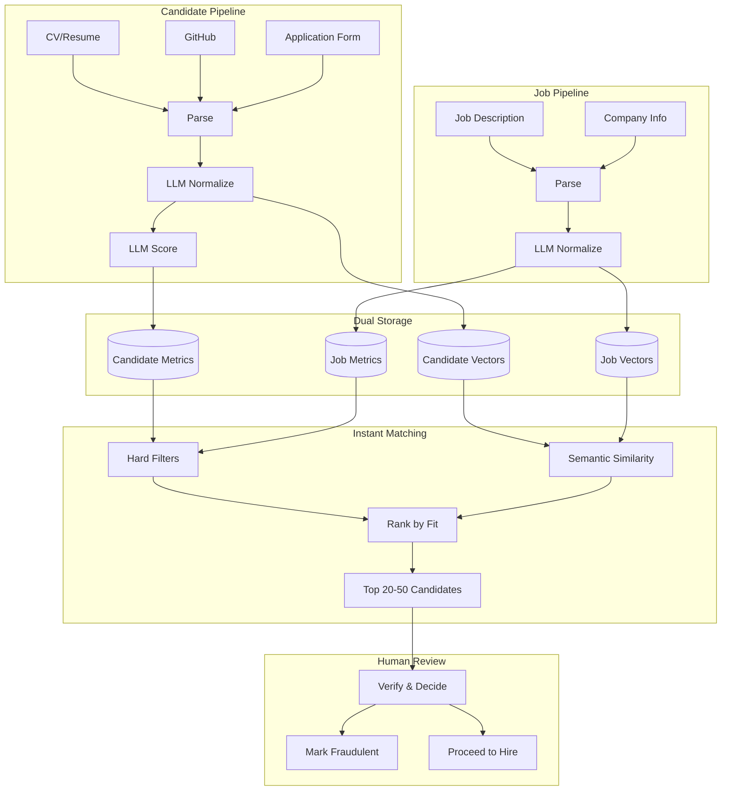
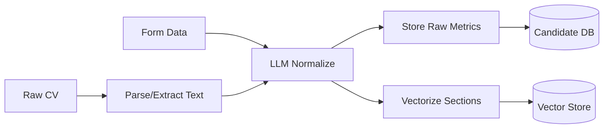
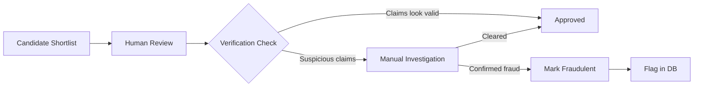
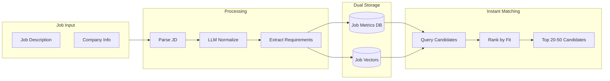
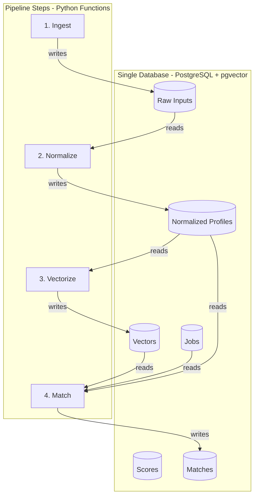

# Short-Term Plan: Talent Evaluation & Matchmaking MVP

---

## Executive Overview

### The Problem

Superteam Talent evaluates thousands of developers in the Solana ecosystem, but current processes rely on inconsistent, manual evaluation of diverse signals (CVs, GitHub, hackathons, references). This doesn’t scale and produces inconsistent results.

### The Solution (MVP)

Build two parallel pipelines that enable instant matching:

**Candidate Pipeline:**
1. **Ingests** candidate data from multiple sources (CV, GitHub, application forms)
2. **Normalizes** profiles using LLMs into a consistent, structured format
3. **Stores** both raw queryable metrics AND semantic vectors
4. **Verifies** claims through human review

**Job Pipeline:**
1. **Ingests** job descriptions and company info
2. **Normalizes** requirements using LLMs (must-have skills, experience level, tech stack)
3. **Stores** job metrics + vectors for matching
4. **Matches** instantly against candidate pool → returns top 20-50 candidates sorted by fit

### Key Architectural Decisions

| Decision | Rationale |
| --- | --- |
| **LLM for normalization & scoring** | Handles diverse CV formats, provides reasoning, easy to iterate via prompts |
| **Dual storage: raw metrics + vectors** | Raw metrics for hard filters (`years >= 5`), vectors for semantic search (“find similar”). Vectors are “mushy” — can’t query precisely on them |
| **Simple quantitative metrics first** | Fast to implement, defer quality analysis to later phases |
| **Human-in-the-loop for verification** | Automated scraping is brittle; humans verify claims and mark fraudulent candidates |
| **Single database (PostgreSQL + pgvector)** | One DB for structured data + vectors. Simple ops, no separate vector DB needed at this scale |
| **Persist all intermediate results** | Every step stores output (raw → normalized → scored). Enables debugging, reprocessing, auditing |
| **Versioned transformation definitions** | Track prompt versions and model versions; know exactly how each score was computed |
| **Optimize for LLM cost, not compute** | LLM API credits are the bottleneck, not storage or CPU. Use GPT-3.5 where possible, cache embeddings |
| **Keep infrastructure simple** | Low scale = no need for Kubernetes, Kafka, Spark. Single server or managed DB + app is enough |

### System Overview



---

## Goals (1-3 Months)

### Primary Objectives

1. **Automate candidate evaluation** — Every incoming candidate gets a consistent, LLM-generated score without manual effort
2. **Enable fast candidate search** — Recruiters can filter by hard criteria (skills, experience) AND find semantically similar candidates
3. **Reduce time-to-shortlist** — Go from thousands of candidates to a human-reviewable shortlist in minutes, not days
4. **Establish data foundation** — Build the structured data layer that enables future ML/advanced features

### Success Metrics

| Metric | Current (Estimate) | Target | How to Measure |
| --- | --- | --- | --- |
| Time to evaluate 1 candidate | ~15-30 min manual | <2 min automated | Processing time logs |
| Evaluation consistency | Variable (subjective) | Consistent scoring rubric | Score distribution analysis |
| Candidate searchability | Limited/manual | Full-text + semantic search | Query response time |
| Shortlist generation time | Hours/days | Minutes | End-to-end pipeline time |
| Recruiter satisfaction | [TODO: Baseline] | [TODO: Target] | Survey/feedback |

---

## Evaluation System MVP

### Data Points to Use

**High-Value Signals (MVP):**

| Signal | Source | Why Important | How to Extract |
| --- | --- | --- | --- |
| **GitHub activity** | GitHub API | Substantiates technical claims, shows real work | API calls for commits, repos, stars, languages |
| **Years of experience** | CV (LLM extracted) | Core seniority signal | LLM normalization |
| **Skills & tech stack** | CV + GitHub | Match against job requirements | LLM extraction + GitHub language stats |
| **Current/past roles** | CV (LLM extracted) | Experience relevance | LLM normalization |
| **Hackathon wins** | Application form / Superteam data | Strong positive signal for Solana ecosystem | Direct data if available |

**Deferred to Later Phases:**
- Detailed 1-5 skill scoring (universal taxonomy approach)
- Code quality analysis (requires LLM code review)
- OSS contribution significance (requires contribution analysis)
- Company tier scoring (requires company database)
- Oversell/undersell detection (requires cross-validation logic)

---

### CV Analysis & Scoring (MVP)

> LLM-powered normalization, scoring, and vectorization — straightforward to implement with prompt engineering.
> 

**Pipeline Overview:**



**Step 1: CV Parsing & Text Extraction**

| Input Format | Extraction Method | Notes |
| --- | --- | --- |
| PDF | pdf-parse, PyMuPDF, or similar | Most common format |
| DOCX | docx library | Extract structured text |
| Plain text | Direct | Already usable |

**Step 2: LLM Normalization**

> Convert inconsistent CV formats into a standardized structure.
> 

**Normalization Prompt Template (Draft):**

```
You are a CV parser. Extract and normalize the following CV into this exact JSON structure:

{
  "name": "...",
  "years_of_experience": <number>,
  "current_role": "...",
  "summary": "2-3 sentence professional summary",
  "skills": {
    "languages": ["..."],
    "frameworks": ["..."],
    "tools": ["..."],
    "domains": ["..."]
  },
  "experience": [
    {
      "company": "...",
      "role": "...",
      "duration_months": <number>,
      "description": "1-2 sentence summary of responsibilities",
      "technologies": ["..."]
    }
  ],
  "education": [...],
  "notable_achievements": ["..."]
}

Be factual. If information is missing, use null.

CV:
---
{raw_cv_text}
---
```

**Step 3: Dual Storage — Raw Metrics + Vectors**

> **Critical:** Store raw metrics separately from vectors. Vectors are “mushy” — useful for search and similarity, but you can’t filter precisely on them.
> 

**Why Both Are Needed:**

| Storage Type | Good For | Bad For |
| --- | --- | --- |
| **Raw Metrics** | Hard filters (“5+ years”), sorting, aggregations, exact matches | Semantic similarity, fuzzy matching |
| **Vectors** | “Find similar candidates”, semantic search, outlier detection | Precise queries, range filters, boolean logic |

**Raw Metrics to Store (Queryable):**

**Core Metrics (Phase 1 - MVP):**

| Metric | Type | Example Query | Primary Use Case |
| --- | --- | --- | --- |
| `years_of_experience` | integer | `WHERE years_of_experience >= 5` | Both IT & BD/Growth |
| `skills` | string[] | `WHERE 'Solana' = ANY(skills)` | Both IT & BD/Growth |
| `current_role` | string | `WHERE current_role ILIKE '%senior%'` | Both IT & BD/Growth |
| `seniority_level` | enum | `WHERE seniority_level IN ('senior', 'lead')` | Both IT & BD/Growth |
| `companies` | string[] | `WHERE 'Google' = ANY(companies)` | Both IT & BD/Growth |
| `location_city` | string | `WHERE location_city = 'San Francisco'` | Both IT & BD/Growth |
| `location_country` | string | `WHERE location_country IN ('USA', 'Germany')` | Both IT & BD/Growth |
| `location_region` | enum | `WHERE location_region IN ('North America', 'Europe')` | Both IT & BD/Growth |
| `compensation_min` | integer | `WHERE compensation_min <= 150000` | Both IT & BD/Growth |
| `compensation_max` | integer | `WHERE compensation_max >= 120000` | Both IT & BD/Growth |
| `average_tenure_months` | integer | `WHERE average_tenure_months >= 18` | Both IT & BD/Growth |
| `longest_tenure_months` | integer | `WHERE longest_tenure_months >= 24` | Both IT & BD/Growth |
| `has_six_month_tenure` | boolean | `WHERE has_six_month_tenure = true` | Both IT & BD/Growth |
| `job_switches_count` | integer | `WHERE job_switches_count <= 5` | Both IT & BD/Growth |

**GitHub Metrics (Phase 1 - MVP, IT specialists only):**

| Metric | Type | Example Query | Primary Use Case |
| --- | --- | --- | --- |
| `github_commits` | integer | `WHERE github_commits > 500` | IT specialists |
| `github_repos` | integer | `WHERE github_repos >= 10` | IT specialists |
| `github_stars` | integer | `ORDER BY github_stars DESC` | IT specialists |
| `github_years_active` | integer | `WHERE github_years_active >= 3` | IT specialists |
| `github_languages` | string[] | `WHERE 'Rust' = ANY(github_languages)` | IT specialists |
| `github_consistency_score` | integer (1-5) | `WHERE github_consistency_score >= 3` | IT specialists |

**Social & Community Metrics (Phase 1 - MVP, BD/Marketing/Growth roles):**

| Metric | Type | Example Query | Primary Use Case |
| --- | --- | --- | --- |
| `social_followers_total` | integer | `WHERE social_followers_total >= 5000` | BD/Marketing/Growth |
| `verified_communities` | string[] | `WHERE 'Superteam' = ANY(verified_communities)` | BD/Marketing/Growth |
| `content_pieces_count` | integer | `WHERE content_pieces_count >= 10` | BD/Marketing/Growth |

**Hackathon & Achievement Metrics (Phase 2 - Optional):**

| Metric | Type | Example Query | Primary Use Case |
| --- | --- | --- | --- |
| `hackathon_win_count` | integer | `WHERE hackathon_win_count >= 2` | IT specialists |
| `hackathon_total_prize_usd` | integer | `WHERE hackathon_total_prize_usd >= 10000` | IT specialists |
| `solana_hackathon_wins` | integer | `WHERE solana_hackathon_wins >= 1` | IT specialists |

**Company Quality Metrics (Phase 3 - Deferred):**

| Metric | Type | Example Query | Primary Use Case |
| --- | --- | --- | --- |
| `company_tier_scores` | integer[] | `WHERE 5 = ANY(company_tier_scores)` | Both IT & BD/Growth |
| `has_big_tech_experience` | boolean | `WHERE has_big_tech_experience = true` | Both IT & BD/Growth |
| `has_solana_experience` | boolean | `WHERE has_solana_experience = true` | Both IT & BD/Growth |
| `has_top_chain_experience` | boolean | `WHERE has_top_chain_experience = true` | Both IT & BD/Growth |

**Vectors to Store (Semantic Search Only):**

**Core Vectors (Phase 1 - MVP, Both IT & BD/Growth):**

| Vector | What to Embed | Semantic Questions It Answers | Primary Use Case |
| --- | --- | --- | --- |
| `position_vectors[]` | Each individual role/project description from the candidate's CV history (1-to-many: candidate → N vectors) | "Who has already done a job like this one?" — match a JD directly against individual past positions to find candidates who held a similar role to the one you're filling | Both IT & BD/Growth |
| `experience_vector` | Concatenated experience descriptions across all roles | "Who has a similar overall work history?" — captures the full arc of what the candidate has worked on, useful for holistic similarity when no single position matches but the cumulative experience does | Both IT & BD/Growth |
| `domain_context_vector` | LLM-generated narrative of the industries, problem spaces, and domains the candidate has worked in (e.g., "DeFi lending protocols", "NFT marketplaces", "enterprise SaaS", "infrastructure tooling", "B2B growth", "developer marketing") | "Who has worked in a similar problem space?" — DeFi lending vs NFT marketplaces vs infra tooling are all "web3" but semantically very different. Matches against the job's product/domain context | Both IT & BD/Growth |
| `personality_vector` | LLM-generated personality/work-style profile inferred from CV signals: writing tone, role descriptions, career choices, interests, community activity, and application form responses (e.g., "builder mentality, prefers early-stage chaos, async-first communicator, hackathon-driven, open-source contributor") | "Who would be a good culture/team fit?" — enables soft matching on work style and personality traits. Useful for team composition (e.g., pairing a scrappy builder with a structured team) and for roles where cultural fit matters as much as technical skills | Both IT & BD/Growth |
| `project_impact_vector` | LLM-extracted narratives of scope, ownership, complexity, and impact from each role - not just what they did, but HOW MUCH they owned and HOW COMPLEX it was. Captures scale of responsibility, technical/business complexity, and measurable outcomes | "Who has owned significant scope?" "Who has navigated high-complexity decisions?" "Who has demonstrated real impact?" — distinguishes between senior IC who owned massive scope vs manager who led people vs junior who contributed to one feature | Both IT & BD/Growth |

**Role-Specific Vectors (Phase 1 - MVP):**

| Vector | What to Embed | Semantic Questions It Answers | Primary Use Case |
| --- | --- | --- | --- |
| `technical_depth_vector` | LLM analysis of technical sophistication signals: systems thinking, architecture choices, technical blog posts, OSS contributions, GitHub repo complexity, infrastructure decisions, performance optimization work | "Who thinks in systems, not just features?" "Who can debug distributed systems?" "Who understands blockchain infrastructure at a deep level?" — beyond "knows Rust", captures HOW DEEPLY they understand systems, performance, scalability | IT specialists |
| `social_presence_vector` | LinkedIn posts, Twitter/X content, blog posts, conference talks, podcast appearances, community contributions, thought leadership content. Captures communication style, industry positioning, and audience engagement | "Who has relevant social proof for a head of BD role?" "Who can represent us at conferences?" "Who has credibility in the Solana ecosystem?" "Who writes compelling content?" — critical for BD/Marketing/Growth roles | BD/Marketing/Growth |
| `community_narrative_vector` | LLM-generated narrative of community involvement: which communities (Superteam, DAOs, Discord servers), contribution type (organizer vs participant), reputation signals, leadership roles, mentorship, event organization | "Who is well-connected in DeFi communities?" "Who has mentored in hackathons?" "Who organizes vs just attends?" "Who has ecosystem influence?" — ecosystem fit and network effects, especially important for Solana-focused roles | BD/Marketing/Growth |

**Enhancement Vectors (Phase 2 - Optional):**

| Vector | What to Embed | Semantic Questions It Answers | Primary Use Case |
| --- | --- | --- | --- |
| `career_trajectory_vector` | Growth story and progression signals - promotions, increasing responsibility, role transitions, learning velocity, strategic career pivots | "Who is rapidly growing?" "Who has made strategic career pivots successfully?" "Who has high future potential?" — identifies high-trajectory candidates even if current title undersells them | Both IT & BD/Growth |
| `values_alignment_vector` | Inferred values/mission from professional summary, company choices, open-source work, community involvement, hackathon projects, stated motivations | "Who cares about decentralization?" "Who values open-source?" "Who is mission-driven vs compensation-driven?" — culture fit and retention prediction | Both IT & BD/Growth |

**Advanced Vectors (Phase 3 - Deferred):**

| Vector | What to Embed | Semantic Questions It Answers | Primary Use Case |
| --- | --- | --- | --- |
| `repository_narrative_vector` | LLM-generated analysis of GitHub repos: project types, code organization, documentation quality, community engagement, originality signals, maintenance patterns | "Who writes well-documented code?" "Who builds tools vs features?" "Who maintains projects long-term?" — qualitative code quality proxy until full LLM code review is available | IT specialists |

**What We’re NOT Doing Yet (Deferred to Long-Term):**

- Oversell/undersell detection (comparing claims vs evidence)
- Cross-validation with GitHub/hackathon data
- Company quality scoring (is "Senior at unknown startup" = "Junior at Google"?)
- Red flag detection (job hopping, gaps, inconsistencies)
- Direct LLM-based suitability comparison between shortlisted candidates and job description

---

### Verification (MVP: Human Review)

> Automated verification (scraping GitHub profiles, hackathon pages) is complex and brittle. For MVP, defer verification to humans and focus on making it easy to flag fraudulent candidates. The automatic shortlist will free up enough time
> 

**Why Defer Automated Verification:**

| Approach | Effort | Maintenance | Accuracy |
| --- | --- | --- | --- |
| **Scraping GitHub/hackathon pages** | High (build scrapers) | High (pages change) | Variable (anti-bot measures) |
| **Human verification at review** | Low (UI only) | Low | High (human judgment) |

**MVP Approach: Human Verification at End of Pipeline**



**What Humans Verify:**

| Claim Type | How to Verify (Manually) | Time Required |
| --- | --- | --- |
| GitHub profile exists | Click profile link | 10 sec |
| Hackathon participation | Search hackathon results page | 1-2 min |
| Company employment | LinkedIn cross-check | 1-2 min |
| Education credentials | University verification (if needed) | Varies |

**Verification Status Field (Add to Data Model):**

```
verification_status: enum
├── unverified      # Default, not yet reviewed
├── verified        # Human confirmed claims
├── suspicious      # Flagged for deeper investigation
└── fraudulent      # Confirmed false claims

verification_notes: text   # Human notes on verification
verified_by: user_id       # Who verified
verified_at: timestamp     # When verified
```

**UI Requirements for Human Reviewers:**

- Display candidate claims alongside links to verify (GitHub URL, hackathon name)
- One-click buttons: "Verified" / "Suspicious" / "Fraudulent"
- Notes field for verification details
- Filter candidates by verification status

**Deferred to Long-Term: Automated Verification**

- GitHub profile scraping to confirm activity matches claims
- Hackathon results page scraping (e.g., Devpost, Solana hackathon sites)
- LinkedIn API integration (if available)
- LLM-based code quality analysis
- Significant OSS contribution detection

---

### Scoring Approach

> Hybrid scoring system combining keyword matching with semantic similarity for comprehensive candidate-job fit assessment.
> 

**Chosen Approach: Keyword Hits + Vector Similarity**

For each job, candidates are scored using a two-component system:

**Component 1: Keyword Match Score (40% weight)**

- Extract keywords from job's `must_have_skills`, `nice_to_have_skills`, and `tech_stack`
- Count exact and fuzzy matches in candidate's profile (skills, technologies, domain experience)
- Normalize to 0-1 scale based on:
    - Must-have keywords: higher weight (e.g., 2x)
    - Nice-to-have keywords: standard weight (1x)
    - Match coverage: percentage of required keywords found

```
keyword_score = (
  (must_have_matches / total_must_have) * 0.6 +
  (nice_to_have_matches / total_nice_to_have) * 0.4
)
```

**Component 2: Vector Similarity Score (60% weight)**

- Use cosine similarity between job vectors and candidate vectors
- Weighted average across multiple semantic dimensions:

```
vector_score = (
  max(cosine_similarity(job.role_description_vector, candidate.position_vectors[])) * 0.35 +  # Best matching past role
  cosine_similarity(job.role_description_vector, candidate.experience_vector) * 0.25 +         # Overall experience fit
  cosine_similarity(job.domain_context_vector, candidate.domain_context_vector) * 0.25 +      # Domain alignment
  cosine_similarity(job.culture_vector, candidate.personality_vector) * 0.15                  # Culture/team fit
)
```

**Final Match Score:**

```
final_score = (keyword_score * 0.4) + (vector_score * 0.6)
Result: Score from 0-1, where 1 = perfect match
```

**Rationale:**

- **Keyword matching** ensures candidates have the specific technical skills mentioned in the job posting (precision)
- **Vector similarity** captures semantic fit beyond exact keyword matches, including related experience and soft factors (recall)
- **60/40 split** favors semantic understanding while still requiring baseline keyword alignment
- **Position vectors array** allows matching against any single past role that's similar to the job, not just overall career arc

### Automation Level

> [TODO: What runs automatically vs requires human review?]
> 

| Step | Automated? | Human Review? | Notes |
| --- | --- | --- | --- |
| Data ingestion | [TODO] | [TODO] | [TODO] |
| Profile normalization | [TODO] | [TODO] | [TODO] |
| Signal extraction | [TODO] | [TODO] | [TODO] |
| Scoring | [TODO] | [TODO] | [TODO] |
| Final decision | [TODO] | [TODO] | [TODO] |

---

## Matchmaking MVP

### Job & Company Ingestion Pipeline

> Mirror the candidate pipeline: ingest job descriptions → normalize → extract requirements → store metrics + vectors → enable instant candidate matching.
> 

**Pipeline Overview:**



**Step 1: Job Description Normalization**

> Convert free-form job descriptions into structured requirements.
> 

**Job Normalization Prompt Template (Draft):**

```
You are a job description parser. Extract and normalize this job posting into structured JSON:

{
  "title": "...",
  "seniority_level": "junior|mid|senior|lead|principal",
  "employment_type": "full-time|part-time|contract",

  "requirements": {
    "must_have_skills": ["..."],           # Hard requirements
    "nice_to_have_skills": ["..."],        # Preferred but not required
    "years_of_experience_min": <number>,
    "years_of_experience_max": <number>,   # null if no max
    "education_required": "...",           # or null
    "domain_experience": ["..."]           # e.g., "DeFi", "NFT", "Trading"
  },

  "role_description": "2-3 sentence summary of what the role does",
  "team_context": "...",                   # Team size, reporting structure
  "tech_stack": ["..."],                   # Specific technologies mentioned

  "compensation": {                        # If mentioned
    "salary_min": <number>,
    "salary_max": <number>,
    "currency": "USD",
    "equity": true|false
  },

  "location": {
    "type": "remote|hybrid|onsite",
    "locations": ["..."]                   # If onsite/hybrid
  }
}

Be factual. If information is not mentioned, use null.

Job Description:
---
{job_description_text}
---
```

**Step 2: Dual Storage for Jobs**

> Same principle as candidates: raw metrics for filtering, vectors for semantic matching.
> 

**Job Metrics (Queryable):**

| Metric | Type | Example Query |
| --- | --- | --- |
| `seniority_level` | enum | `WHERE seniority_level = 'senior'` |
| `must_have_skills` | string[] | `WHERE 'Rust' = ANY(must_have_skills)` |
| `years_of_experience_min` | int | `WHERE years_of_experience_min <= candidate.years` |
| `employment_type` | enum | `WHERE employment_type = 'full-time'` |
| `location_type` | enum | `WHERE location_type = 'remote'` |
| `domain_experience` | string[] | `WHERE 'DeFi' = ANY(domain_experience)` |

**Job Vectors (Semantic Matching):**

| Vector | What to Embed | Matching Purpose |
| --- | --- | --- |
| `role_description_vector` | Full job description and responsibilities from the JD | Match against `candidate.position_vectors[]` (best past role) and `candidate.experience_vector` (overall experience) — finds candidates who have done similar work |
| `domain_context_vector` | LLM-generated narrative of the product domain, industry, and problem space (e.g., "DeFi lending protocol for institutional traders", "NFT marketplace with creator tools", "blockchain infrastructure for gaming") | Match against `candidate.domain_context_vector` — ensures domain expertise alignment (DeFi vs NFT vs infrastructure are semantically different) |
| `culture_vector` | LLM-generated company culture and team working style inferred from JD signals: company stage, team size, communication style, work environment mentions (e.g., "fast-paced startup, high autonomy, remote-first, builder-focused culture") | Match against `candidate.personality_vector` — soft matching for culture and team fit |

**Step 4: Instant Candidate Matching**

> When a job is ingested, immediately return top matching candidates.
> 

**Matching Algorithm Overview:**

The matching process combines traditional filtering with semantic vector similarity in a single PostgreSQL query:

**Phase 1: Hard Filters**

- Filter candidates by minimum requirements (years of experience, verification status)
- Eliminate candidates marked as fraudulent
- Optionally filter by must-have skills if strict matching is required

**Phase 2: Keyword Scoring (40% of final score)**

- Calculate what percentage of the job's must-have skills the candidate possesses
- Calculate what percentage of nice-to-have skills they have
- Combine into a single keyword match score: `(must_have_coverage * 0.6) + (nice_to_have_coverage * 0.4)`
- Uses standard PostgreSQL array operations (`ANY`, `array_length`, `UNNEST`)

**Phase 3: Vector Similarity Scoring (60% of final score)**

- **Best Position Match (35%):** Find the candidate's past role that's most similar to the job description by comparing the job's `role_description_vector` against each vector in the candidate's `position_vectors[]` array and taking the maximum similarity
- **Overall Experience Fit (25%):** Compare job description vector to candidate's aggregated `experience_vector`
- **Domain Alignment (25%):** Compare job's `domain_context_vector` to candidate's `domain_context_vector`
- **Culture Fit (15%):** Compare job's `culture_vector` to candidate's `personality_vector`
- Combine weighted similarities into a single vector score

**Phase 4: Final Ranking**

- Combine keyword score and vector score: `(keyword_score * 0.4) + (vector_score * 0.6)`
- Sort candidates by final match score (descending)
- Return top 50 candidates with detailed score breakdown

### Why pgvector Dramatically Simplifies This

**Without pgvector:** Separate vector database (Pinecone, Weaviate) + PostgreSQL → multiple queries, cross-database joins in application code, data sync issues

**With pgvector:** Single SQL query in PostgreSQL handles filtering, vector similarity, keyword matching, scoring, and ranking in one transaction

**Key advantages:**

- **Single database** → No separate vector DB to maintain, simpler architecture, no data sync problems
- **One SQL query does everything** → Eliminates network round trips, combines structured filters with vector similarity in a single optimized operation
- **Excellent performance at this scale** → PostgreSQL with HNSW indexes handles thousands of candidates efficiently without specialized infrastructure

---

## Trade-offs

> It is enough to cut down the current workload by 80% with 20% of possible effort.
> 
- **GitHub scoring is quantity-based, not quality-based** — We count commits/repos/stars but don't analyze code quality. This is fast to implement but may miss high-quality developers with fewer but better contributions. Revisit in Phase 2+ with LLM analysis.
- **No originality detection** — We can't distinguish copied code from original work. Deferred to long-term LLM-based analysis.
- **CV scoring trusts claims at face value** — MVP LLM scoring assumes CV content is accurate. No cross-validation with GitHub or verification of claims. Deferred to Phase 2 oversell/undersell detection.
- **No company tier adjustment** — "Senior at startup" = "Senior at Google" in MVP scoring. Context-aware role normalization deferred to Phase 3.
- **Verification is manual, not automated** — Building scrapers for GitHub profiles, hackathon pages, etc. is complex and brittle (pages change, anti-bot measures). Humans verify claims at end of pipeline; they can mark candidates as fraudulent. Automated verification deferred to long-term.

---

## Technical Platform

### Requirements Analysis

| Requirement | Priority | Implication |
| --- | --- | --- |
| **Modularity** | High | Each pipeline step is a separate component; can swap implementations |
| **Intermediate result storage** | High | Every transformation persists its output; enables debugging, reprocessing |
| **Transformation definitions** | High | Clear, versioned definitions of each processing step |
| **Low scalability needs** | Context | Thousands of candidates, not millions; don’t over-engineer |
| **LLM-heavy workloads** | Cost driver | Main cost is API credits, not compute/storage |

### Why NOT Complex Infrastructure

| Approach | Why Avoid |
| --- | --- |
| Kubernetes / microservices | Overkill for volume; adds operational complexity |
| Real-time streaming (Kafka, etc.) | Not needed; batch processing is fine |
| Data lake / Spark | Scale isn’t there; adds unnecessary layers |
| Complex ML pipelines (Kubeflow, etc.) | LLMs are API calls, not custom model training |

### Recommended Architecture: Pipeline with Persistent Steps

**Core Principle:** Each step reads input → transforms → stores output. All intermediate results are queryable.



### Technology Choices

| Component | Recommendation | Rationale |
| --- | --- | --- |
| **Database** | PostgreSQL + pgvector extension | Single DB for everything: structured data + vectors. Simple ops, ACID, mature tooling |
| **Vector storage** | pgvector (in PostgreSQL) | No separate vector DB needed at this scale; keeps architecture simple |
| **Application layer** | Python | Best LLM & DataSci library ecosystem (OpenAI, Anthropic, LangChain if needed) |
| **Pipeline orchestration** | Dagster | Perfectly reflects our needs and has a modern UI/UX, even for non-technical users |
| **LLM provider** | OpenAI / Anthropic / Claude | Choose based on quality vs cost tradeoffs |
| **Embeddings** | OpenAI embeddings OR open-source (e.g., sentence-transformers) | OpenAI is easy; open-source is cheaper at volume |
| **Queue (optional)** | Redis or PostgreSQL-based queue | Only if async processing needed; can start without |

### Intermediate Result Storage Pattern

> Every pipeline step stores its output. This enables:
- Debugging (inspect any step’s output)
- Reprocessing (re-run from any point without starting over)
- Auditing (trace how a score was computed)
- Versioning (compare old vs new transformation logic)
> 

**Storage Structure:**

| Table | Contents | Key Fields |
| --- | --- | --- |
| `raw_candidates` | Original CV text, GitHub data as-is | `id`, `source`, `raw_data`, `ingested_at` |
| `normalized_candidates` | LLM-normalized structured profile | `id`, `candidate_id`, `normalized_json`, `prompt_version`, `created_at` |
| `candidate_vectors` | Embeddings for each section | `id`, `candidate_id`, `vector_type`, `vector`, `model_version` |
| `raw_jobs` | Original job description | `id`, `raw_description`, `company_id`, `ingested_at` |
| `normalized_jobs` | LLM-normalized job requirements | `id`, `job_id`, `normalized_json`, `prompt_version`, `created_at` |
| `job_vectors` | Job embeddings | `id`, `job_id`, `vector_type`, `vector`, `model_version` |
| `matches` | Computed matches | `id`, `job_id`, `candidate_id`, `match_score`, `breakdown_json`, `created_at` |

### Transformation Definitions

> Each transformation is defined by:
- Input schema (what it reads)
- Output schema (what it produces)
- Transformation logic (prompt template OR function)
- Version (for tracking changes)
> 

**Transformation Registry:**

| Step | Input | Output | Logic Type | Versioned? |
| --- | --- | --- | --- | --- |
| Ingest CV | PDF/DOCX/Text | Raw text | Parser function | Yes |
| Normalize CV | Raw text | Structured JSON | LLM prompt template | Yes |
| Vectorize | Normalized JSON | Float vectors | Embedding model | Yes (model version) |
| Ingest Job | Job description text | Raw text | Parser function | Yes |
| Normalize Job | Raw text | Structured JSON | LLM prompt template | Yes |
| Match | Job + Candidates | Match results | Query + ranking formula | Yes |

### LLM Cost Management

> LLM calls are the primary cost driver. Optimize for cost, not compute.
> 

**Cost Estimation:**

| Operation | Tokens (est.) | Cost per Candidate (GPT-4) | Cost per Candidate (GPT-3.5) |
| --- | --- | --- | --- |
| CV Normalization | ~2,000 input + 500 output | ~$0.08 | ~$0.005 |
| CV Scoring | ~1,000 input + 300 output | ~$0.04 | ~$0.003 |
| Embeddings (3 sections) | ~1,500 tokens | ~$0.0003 | ~$0.0003 |
| **Total per candidate** |  | **~$0.12** | **~$0.008** |

**Cost Optimization Strategies:**

| Strategy | Description |
| --- | --- |
| Use GPT-3.5 for normalization, GPT-4 for scoring | Normalization is structured extraction; scoring needs reasoning |
| Cache embeddings | Don’t re-embed unchanged content |
| Batch processing | Process candidates in batches to optimize API usage |
| Skip re-processing | Track `prompt_version`; only re-process if prompt changed |
| Open-source embeddings | Use local embedding models to eliminate embedding API costs |

### MVP Implementation Plan

> Self-hosted stack: Dagster OSS + PostgreSQL with pgvector + Python service
> 

**Phase 1: Infrastructure Setup (Week 1)**

1. **Provision single VPS**
    - Specs: 4-8 GB RAM, 2-4 vCPUs, 50-100 GB SSD
    - OS: Ubuntu 22.04 LTS
    - Provider: DigitalOcean, AWS EC2, Hetzner, or similar
2. **Install PostgreSQL 17+ with pgvector extension**
    - Create `talent_matching` database
    - Enable pgvector extension for vector operations
    - Configure authentication and access controls
3. **Set up Python 3.11+ environment**
    - Create virtual environment
    - Install dependencies: Dagster, psycopg2, pgvector, OpenAI/Anthropic SDKs, PDF/DOCX parsers
4. **Install and configure Dagster OSS**
    - Configure Dagster to use PostgreSQL for run storage, event logs, and schedules
    - Set up Dagster home directory and configuration files
    - Test daemon and webserver startup

---

**Phase 2: Database Schema & Core Logic (Week 1-2)**

1. **Design and implement database schema**
    - Tables: `raw_candidates`, `normalized_candidates`, `candidate_vectors`, `raw_jobs`, `normalized_jobs`, `job_vectors`, `matches`
    - Use JSONB for flexible storage of normalized data
    - Create HNSW indexes on vector columns for fast similarity search
    - Track versioning: `prompt_version`, `model_version` on all transformation tables
2. **Build Python service structure**
    - **Dagster assets** for each pipeline step (ingestion, normalization, vectorization, matching)
    - **Resources** for database connections and LLM clients
    - **Reusable operations** for parsing, embeddings, GitHub API calls
    - Store prompt templates as separate text files for easy iteration
3. **Implement candidate pipeline**
    - CV parsing (PDF, DOCX, text)
    - LLM normalization to structured JSON
    - GitHub API integration for activity metrics
    - Vector generation for position, experience, domain, personality
4. **Implement job pipeline**
    - Job description normalization
    - Vector generation for role, domain, culture
5. **Implement matching algorithm**
    - Single PostgreSQL query combining hard filters, keyword matching, and vector similarity
    - Weighted scoring: 40% keyword + 60% vector
    - Return top 50 matches with score breakdown

---

**Phase 3: Testing & Deployment (Week 2-3)**

1. **Local testing**
    - Test individual pipeline steps with sample data
    - Verify prompt outputs and vector quality
    - Validate matching results
2. **Production deployment**
    - Set up systemd services for Dagster daemon and webserver
    - Configure firewall rules (PostgreSQL: [localhost](http://localhost) only, Dagster UI: internal network)
    - Set up database backups
    - Configure monitoring and alerting
3. **Initial data load**
    - Ingest existing candidate CVs
    - Process GitHub data for existing candidates
    - Create test job postings and validate matches

---

**Development Workflow**

1. Define Dagster assets for each pipeline step
2. Test locally using Dagster dev mode
3. Materialize assets via Dagster UI
4. Monitor runs and debug via Dagster UI
5. Iterate on prompts and re-materialize
6. Query results directly in PostgreSQL for validation

---

**Deployment Checklist**

- [ ]  VPS provisioned and secured
- [ ]  PostgreSQL installed with pgvector enabled
- [ ]  Database schema created
- [ ]  Python environment configured
- [ ]  Dagster configured with PostgreSQL backend
- [ ]  LLM API keys configured
- [ ]  GitHub API token configured
- [ ]  Dagster services running (daemon + webserver)
- [ ]  Firewall rules configured
- [ ]  Database backups configured
- [ ]  Initial test run completed successfully

### Cost Estimate

| Component | Technology | Hosting | Estimated Cost |
| --- | --- | --- | --- |
| **Orchestration** | Dagster OSS (self-hosted) | Single VPS | $0 (included in VPS cost) |
| **Database** | PostgreSQL 15+ with pgvector | Same VPS (self-hosted) | $0 (included in VPS cost) |
| **Python Runtime** | Python 3.11+ | Same VPS | $0 (included in VPS cost) |
| **VPS Hosting** | 4-8 GB RAM, 2-4 vCPUs, 50-100 GB SSD | DigitalOcean, AWS, Hetzner, etc. | $40-80/mo |
| **LLM APIs** | OpenAI / Anthropic | API calls | **Main cost driver:** $8-120 per 1000 candidates |

**Total infrastructure cost:** ~$40-80/month + LLM API costs

**This self-hosted setup saves $60-170/month vs. managed services**, with the trade-off of managing your own server.

---

## Risks & Mitigations

| Risk | Likelihood | Impact | Mitigation |
| --- | --- | --- | --- |
| **Poor match relevance** — Top 50 candidates don't include good fits, system fails core purpose | Med | High |   • Start with keyword+vector hybrid scoring (40/60 split) to balance precision and recall
  • Track match quality metrics: recruiter feedback on shortlists, hire conversion rate
  • Build feedback loop: recruiters rate matches, use data to tune weights
  • Keep prompt versions tracked so you can A/B test improvements
  • Plan for iterative tuning: expect 2-3 rounds of weight/prompt adjustments |
| **LLM API costs spiral** — Unpredictable expenses, especially with GPT-4 | Med | High |   • Use GPT-3.5 for normalization, GPT-4 only for complex scoring where reasoning matters
  • Set hard spending limits via OpenAI/Anthropic dashboard alerts
  • Cache embeddings aggressively — store `prompt_version` and `model_version`, only reprocess when changed
  • Monitor per-candidate costs in real-time via Dagster logs
  • Batch processing to optimize API usage
  • Consider open-source embeddings (sentence-transformers) to eliminate embedding API costs entirely |
| **Low recruiter trust** — Users don't trust automated scoring/matching | Med | High |   • Position system as "shortlist assistant" not "automated decision maker"
  • Show score breakdowns: keyword match % + vector similarity components visible to recruiters
  • Keep humans in final decision loop — system narrows pool, humans make hiring calls
  • Start with pilot group of 2-3 recruiters, gather feedback, iterate before full rollout
  • Make system explainable: show which skills matched, which past roles are similar
  • Build confidence gradually: compare automated shortlists vs manual for first 10-20 jobs |
| **LLM hallucinations/extraction errors** — Incorrect normalization of CVs and job descriptions | Med | Med |   • Use strict JSON schema output format with validation
  • Human spot-check: random sample of 5-10% of normalized profiles reviewed weekly
  • Track extraction confidence: flag profiles where LLM returns many `null` values
  • Keep raw data alongside normalized — recruiters can always check original CV
  • Version prompts and A/B test: compare extraction quality across prompt versions
  • Implement basic validation rules: years_of_experience < 50, skills list not empty, etc. |
| **Fraudulent candidate data** — Fake GitHub profiles, inflated CV claims | Med | Med |   • Human verification at review stage: recruiters verify claims before proceeding
  • Add `verification_status` field: unverified → verified → suspicious → fraudulent
  • Build simple fraud detection heuristics: GitHub account <6 months old + high commit count = flag
  • Cross-reference GitHub username with CV email domain where possible
  • Track fraud rate and patterns to improve detection over time
  • Defer automated verification to Phase 2 — manual checking is good enough for MVP |
| **Vector matching quality** — Semantic similarity produces poor/irrelevant matches | Med | Med |   • Start with hybrid approach: 40% keywords + 60% vectors balances both signals
  • A/B test different embedding models: OpenAI vs sentence-transformers vs Cohere
  • Test multiple vector types: position_vectors[], experience_vector, domain_context_vector
  • Monitor match quality: track which vector types correlate with good hires
  • Tune weights iteratively based on recruiter feedback
  • Keep escape hatch: recruiters can always do pure keyword search if semantic search fails |
| **Data privacy/compliance** — Handling sensitive candidate PII without proper controls | Low | High |   • Document data handling: what's stored, who has access, retention policies
  • Implement access controls: only authorized recruiters can view candidate data
  • Use encrypted connections: HTTPS for app, SSL for database connections
  • Add candidate consent: notify candidates their data will be processed
  • Review GDPR/privacy requirements specific to your region
  • Plan data retention policy: delete candidate data after X months of inactivity
  • For MVP, focus on access controls and consent — full compliance audit can come later |
| **Single point of failure** — Self-hosted VPS means downtime = complete outage | Low-Med | Med |   • Set up automated daily database backups to cloud storage (S3, Backblaze)
  • Use VPS provider with 99.9%+ uptime SLA
  • Document recovery procedure: restore from backup in <1 hour
  • Start simple, but plan migration path to managed PostgreSQL (e.g., AWS RDS) if uptime becomes critical
  • Set up basic monitoring: UptimeRobot or similar to alert on downtime
  • MVP is batch-processing system, not real-time — occasional downtime is tolerable |
| **LLM provider outages** — Dependency on OpenAI/Anthropic availability | Low | Med |   • Implement retry logic with exponential backoff
  • Queue failed jobs in Dagster for automatic retry when service recovers
  • Consider multi-provider fallback: if OpenAI down, fall back to Anthropic
  • MVP is batch system, not real-time — delays of a few hours are acceptable
  • Track provider uptime and error rates to inform future decisions |
| **Inconsistent CV formats** — PDFs with tables, images, unusual layouts break parsing | High | Low |   • Test parser on diverse CV samples before launch (10-20 different formats)
  • Track parsing failures: flag CVs where extraction produced <100 words
  • Human fallback: if parsing fails, recruiter manually enters key fields
  • Iterate on parser: identify problematic formats, add handling
  • LLMs are surprisingly robust to messy text — even imperfect parsing often works
  • For MVP, manual fallback for 5-10% of CVs is acceptable |
| **Missing critical information** — CVs lacking key details needed for matching | High | Low |   • LLM prompts explicitly handle missing data: use `null` for missing fields
  • Matching algorithm handles sparse data: scores based on available information only
  • Flag incomplete profiles: "low confidence match — missing years_of_experience"
  • For critical jobs, recruiters can manually enrich profiles before matching
  • Set minimum data threshold: need at least 3 of 5 key fields to include in shortlist |
| **GitHub API rate limits** — Bulk processing hits 5,000 requests/hour limit | Low-Med | Low-Med |   • Use authenticated GitHub API (5,000/hour vs 60/hour unauthenticated)
  • Implement exponential backoff and retry logic for rate limit errors
  • Cache GitHub data aggressively — store with timestamp, refresh only if >7 days old
  • Process candidates in batches: 100-200/hour to stay under limits
  • For bulk historical import: spread over multiple days if needed
  • Monitor rate limit headers in API responses, throttle proactively |