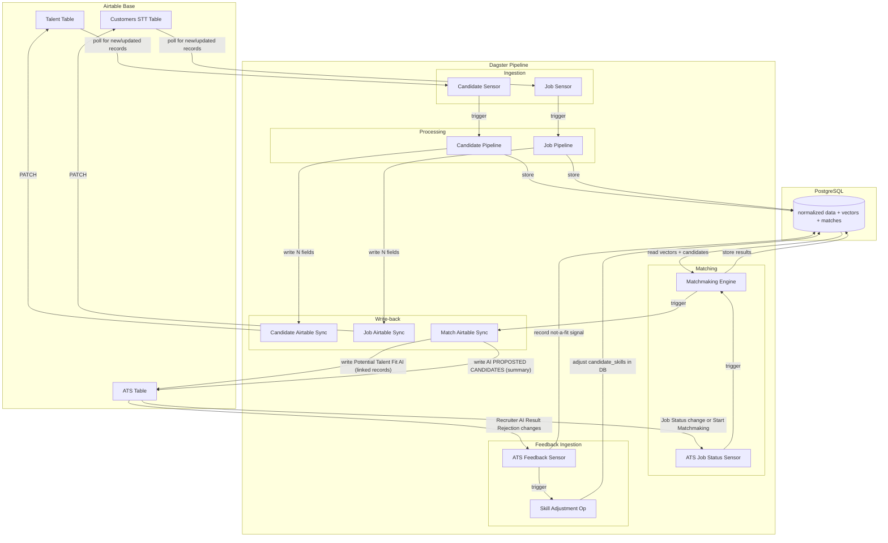

# Airtable Integration: Control Flow & Match Upload

## Overview

This document describes the full control flow between our Dagster pipeline and the Airtable base, covering:

1. The Airtable table topology and which tables trigger which pipeline stages
2. How matchmaking results are uploaded to the ATS table
3. How the ATS `Job Status` dropdown drives sensors
4. The complete data flow from ingestion through matching to recruiter review

---

## Airtable Table Topology

The base contains three tables relevant to our pipeline:

```
┌─────────────────────────────────────────────────────────────┐
│ Talent (tblOkLOSo4Zjwp0yF)                                 │
│ ─ Candidate profiles, CVs, (N)-prefixed normalized fields   │
│ ─ Linked record columns point INTO the ATS table            │
│   (Job Match, Potential Talent Fit, In Interview, etc.)     │
└──────────────────────────┬──────────────────────────────────┘
                           │ linked via multipleRecordLinks
                           ▼
┌─────────────────────────────────────────────────────────────┐
│ ATS (tblrbhITEIBOxwcQV)                                     │
│ ─ One record per open position (job)                        │
│ ─ "Job Status" dropdown drives the recruiting pipeline      │
│ ─ Linked record columns for candidates at each stage        │
│ ─ Links to Company via "Company" field                      │
└──────────────────────────┬──────────────────────────────────┘
                           │ linked via multipleRecordLinks
                           ▼
┌─────────────────────────────────────────────────────────────┐
│ Customers STT (tbl9KNjT3G08f6oXh)                           │
│ ─ Company/customer records                                  │
│ ─ Job description link, hiring contact, (N)-prefixed fields │
│ ─ "Stage" dropdown for sales pipeline                       │
│ ─ "ATS Jobs" links to ATS records for this company          │
│ ─ "Start Matchmaking" checkbox (current trigger)            │
└─────────────────────────────────────────────────────────────┘
```

### Key table roles

| Table | ID | Role in pipeline |
|---|---|---|
| **Talent** | `tblOkLOSo4Zjwp0yF` | Source of candidate data. Pipeline writes `(N)` normalized fields back here. |
| **Customers STT** | `tbl9KNjT3G08f6oXh` | Source of company/job description data. Pipeline writes `(N)` normalized job fields back here. Contains `Start Matchmaking` checkbox. |
| **ATS** | `tblrbhITEIBOxwcQV` | Recruiting pipeline tracker. One row per open position. Contains `Job Status` dropdown and all candidate-stage linked record columns. **This is where match results should be written and where recruiter feedback originates.** |

---

## ATS Table: Candidate Stage Columns

The ATS table uses linked record columns (pointing to the Talent table) to track which candidates are at which stage of the hiring process. Each column represents a stage:

### AI-managed columns (written by our system)

| ATS Column | Direction | Purpose |
|---|---|---|
| `Potential Talent Fit AI` | **Pipeline → Airtable** | Top-N matched candidates from matchmaking. Our system writes here after scoring. |
| `Recruiter AI Result Rejection` | **Airtable → Pipeline** | Candidates the recruiter moved out of AI matches as "not a fit". Sensor reads these to record negative feedback. |

### Recruiter-managed columns (progression through pipeline)

| ATS Column | Direction | Purpose |
|---|---|---|
| `Potential Talent Fit` | Manual | Candidates the human recruiter added as potential fits (non-AI). |
| `Potential Talent Fit Nick` | Manual | Nick's personal potential fit picks. |
| `Potential Talent Fit NOE` | Manual | Noe's personal potential fit picks. |
| `Shortlisted Talent` | Manual | Candidates promoted from potential fit to shortlist. |
| `Client Introduction` | **Airtable → Pipeline** | Candidates introduced to the hiring company. |
| `In Interview 1` | Manual | First round interview. |
| `Interview: Assignment` | Manual | Technical assignment stage. |
| `In Interview 2` – `In Interview 4` | Manual | Subsequent interview rounds. |
| `In Negotiations` | Manual | Offer negotiation stage. |
| `Hired` | Manual | Successfully hired. |

### Rejection columns (feedback signals)

| ATS Column | Direction | Purpose |
|---|---|---|
| `Introduction Rejected Talent` | **Airtable → Pipeline** | Client rejected after introduction. |
| `Interview Rejected Talent` | **Airtable → Pipeline** | Rejected after interview. |
| `Assignment Rejected Talent` | **Airtable → Pipeline** | Rejected after assignment. |
| `Negotiations rejection` | **Airtable → Pipeline** | Rejected during negotiations. |
| `Talent Rejected Job` | **Airtable → Pipeline** | Candidate rejected the job. |
| `Considered Talent (Job On Hold)` | Manual | Candidates parked when job goes on hold. |

### Text summary columns on ATS (informational)

| ATS Column | Type | Purpose |
|---|---|---|
| `AI PROPOSTED CANDIDATES` | singleLineText | Summary of AI-proposed candidates (could hold score summary). |
| `MATCHED CANDIDATES` | singleLineText | Summary of matched candidates. |
| `REJECTED PROPOSTED CANDIDATES` | singleLineText | Summary of rejected AI proposals. |
| `SMART IEALD CANDIDATE PROFILE` | singleLineText | Ideal candidate profile text. |
| `Feedback` | multilineText | General recruiter feedback on the job/matching quality. |

---

## ATS Job Status Dropdown

The `Job Status` field on the ATS table is a single-select with these choices:

```
Sourcing
Initial Recruiting
Ongoing Recruiting
Client Introduction
In Interview
Probation period
Offer
Hired
On Hold
Backlog
Position closed
Disqualified
```

### Proposed sensor triggers based on Job Status

| Status transition | Sensor action |
|---|---|
| Any → `Sourcing` | Trigger matchmaking for this ATS job (compute matches, populate `Potential Talent Fit AI`). |
| Any → `Initial Recruiting` | Re-trigger matchmaking if no AI matches exist yet, or no-op if already matched. |
| Any → `On Hold` | Move all candidates from active columns to `Considered Talent (Job On Hold)`. Pause further sensor activity. |
| Any → `Position closed` / `Disqualified` | Archive match results. No further pipeline activity. |
| Any → `Hired` | Record successful hire. Log which candidate was hired for algorithm feedback. |

The existing `Start Matchmaking` checkbox on the Customers STT table can remain as an additional manual trigger for re-matching (e.g., after editing `(N)` fields). The new ATS-based sensor complements it by providing status-driven automation.

---

## Complete Control Flow



---

## Phase 1: Match Upload to ATS

### What happens after matchmaking

Currently, the `matches` asset computes top-20 candidates per job and stores them in the `matches` Postgres table. After this, nothing goes to Airtable.

**New behavior:** After matches are stored, a new `airtable_matches_sync` asset writes the results to the ATS table.

### Linking Customers STT to ATS

Our pipeline processes jobs using the Customers STT table (partition key = Customers STT record ID). To write matches to the ATS table, we need to resolve the corresponding ATS record(s).

**Resolution path:**
1. The Customers STT record has an `ATS Jobs` linked record field pointing to ATS records.
2. Read the Customers STT record's `ATS Jobs` field to get the ATS record ID(s).
3. For each ATS record, write the matched candidate Airtable record IDs to `Potential Talent Fit AI`.

If the Customers STT record has multiple ATS jobs (multiple positions for one company), the match results should be written to the ATS record whose `Open Position (Job Title)` best matches the normalized job title. Alternatively, the ATS record ID could be stored on the `normalized_jobs` row in Postgres (new column `ats_record_id`).

### Data written to ATS per match run

| ATS Field | Value |
|---|---|
| `Potential Talent Fit AI` | Array of Talent record IDs (top-N matched candidates, ordered by score). Airtable renders these as linked record chips. |
| `AI PROPOSTED CANDIDATES` | Comma-separated summary: "Name (score%), Name (score%), ..." for quick scanning. |
| `MATCHED CANDIDATES` | Same as above or a count: "20 candidates matched on 2026-02-25". |

### Implementation: `airtable_matches_sync` asset

```python
@asset(
    partitions_def=job_partitions,
    ins={"matches": AssetIn()},
    description="Write matched candidates to ATS Potential Talent Fit AI column",
    group_name="matching",
    required_resource_keys={"airtable_jobs", "airtable_ats", "matchmaking"},
    op_tags={"dagster/concurrency_key": "airtable_api"},
)
def airtable_matches_sync(
    context: AssetExecutionContext,
    matches: list[dict[str, Any]],
) -> dict[str, Any]:
    ...
```

This requires:
1. A new `AirtableATSResource` (or extend `AirtableJobsResource`) configured with `AIRTABLE_ATS_TABLE_ID`.
2. A method to resolve job partition key → ATS record ID.
3. A method to resolve candidate Postgres IDs → Talent Airtable record IDs.
4. PATCH the ATS record's `Potential Talent Fit AI` with the candidate record IDs.

### Resource changes

Add to `.env`:
```
AIRTABLE_ATS_TABLE_ID=tblrbhITEIBOxwcQV
```

Add a new `AirtableATSResource` in `talent_matching/resources/airtable.py` (same pattern as `AirtableJobsResource`) with methods:
- `update_record(record_id, fields)` — PATCH linked record fields
- `fetch_record_raw_fields(record_id)` — read current field values
- `fetch_records_by_job_status(status)` — filter by Job Status dropdown

### Job changes

Update `matchmaking_job` and `matchmaking_with_feedback_job` to include `airtable_matches_sync`:

```python
matchmaking_job = define_asset_job(
    name="matchmaking",
    selection=[matches, airtable_matches_sync],  # added
    partitions_def=job_partitions,
)
```

---

## Phase 2: ATS Job Status Sensor

### Replace checkbox trigger with status-driven sensor

The current `airtable_job_matchmaking_sensor` polls for `Start Matchmaking = TRUE()` on the Customers STT table. This works but requires manual checkbox toggling.

**New sensor:** `ats_job_status_sensor` polls the ATS table for records where `Job Status` has changed to a trigger value (e.g., `Sourcing` or `Initial Recruiting`).

### Sensor design

```python
@sensor(
    job=matchmaking_job,
    minimum_interval_seconds=300,
    description="Polls ATS Job Status changes to trigger matchmaking",
    required_resource_keys={"airtable_ats", "matchmaking"},
)
def ats_job_status_sensor(context: SensorEvaluationContext):
    """Detect ATS jobs transitioning to matchmaking-eligible statuses."""
    ...
```

**Cursor state:** The sensor stores a JSON cursor with `{record_id: last_known_status}` for all ATS records. On each tick, it fetches all ATS records, compares statuses, and yields `RunRequest` for records whose status transitioned to a matchmaking-eligible value.

**Trigger statuses:**
- `Sourcing` → run full matchmaking
- `Initial Recruiting` → run matchmaking if no existing matches

**The existing `Start Matchmaking` checkbox sensor continues to work** as a manual override for re-matching after `(N)` field edits.

### Linking ATS record to job partition

The ATS record links to a Customers STT record via its `Company` field. The job partition key in our system is the Customers STT record ID. The sensor needs to:
1. Read the ATS record's `Company` linked field to get the Customers STT record ID.
2. Use that as the partition key for the `RunRequest`.
3. Store the ATS record ID in run config or tags so `airtable_matches_sync` knows where to write.

---

## Phase 3: Feedback Paths (see companion document)

Detailed in [Match Feedback & Skill Adjustment System](./match-feedback-and-skill-adjustment.md).

Summary of feedback paths:

1. **Not-a-fit rejection:** Recruiter drags a candidate from `Potential Talent Fit AI` to `Recruiter AI Result Rejection`. A sensor detects this and records negative match feedback in Postgres.

2. **Skill rating adjustment:** Recruiter adds notes about a candidate's skills (via a feedback column or the Rejection Log table). A sensor reads these and adjusts `candidate_skills` ratings in Postgres.

3. **Successful hire signal:** When `Job Status` moves to `Hired` and a candidate is in the `Hired` column, the sensor records a positive outcome for algorithm learning.

---

## Airtable API Considerations

### Linked record writes

Writing to a `multipleRecordLinks` field requires sending an array of Airtable record IDs:

```json
{
  "fields": {
    "Potential Talent Fit AI": [
      {"id": "recABC123"},
      {"id": "recDEF456"}
    ]
  }
}
```

The current `update_record` method on our Airtable resources already supports this; we just need to pass the correct structure.

### Rate limits

Airtable API allows 5 requests per second per base. Our sensors already use `dagster/concurrency_key: airtable_api` to serialize API calls. Batch updates (up to 10 records per PATCH) should be used when updating multiple ATS records.

### Resolving candidate IDs

Our `matches` table stores `candidate_id` (Postgres UUID). We need the candidate's `airtable_record_id` from `normalized_candidates` to write linked records. The `matchmaking` resource already provides this mapping.

---

## Summary of Code Changes

| Area | File(s) | Change |
|---|---|---|
| New resource | `talent_matching/resources/airtable.py` | Add `AirtableATSResource` class |
| Resource config | `talent_matching/definitions.py`, `.env` | Register `airtable_ats` resource with `AIRTABLE_ATS_TABLE_ID` |
| New asset | `talent_matching/assets/jobs.py` | Add `airtable_matches_sync` asset |
| Mapper | `talent_matching/utils/airtable_mapper.py` | Add `matches_to_ats_fields()` function |
| Job update | `talent_matching/jobs/__init__.py` | Add `airtable_matches_sync` to matchmaking jobs |
| New sensor | `talent_matching/sensors/ats_sensor.py` | Add `ats_job_status_sensor` |
| Definitions | `talent_matching/definitions.py` | Register new sensor and resource |
| Matchmaking resource | `talent_matching/resources/matchmaking.py` | Add method to resolve candidate UUIDs to Airtable record IDs |
| Feedback sensor | `talent_matching/sensors/ats_sensor.py` | Add `ats_feedback_sensor` (Phase 3) |
| DB migration | `migrations/` | Add `ats_record_id` column to `normalized_jobs` (optional) |
| Setup script | `scripts/` | Script to verify ATS table column structure |

---

## Implementation Order

1. **Add `AirtableATSResource`** — same pattern as existing `AirtableJobsResource`, pointed at the ATS table.
2. **Add `airtable_matches_sync` asset** — reads match results, resolves candidate record IDs, PATCHes ATS `Potential Talent Fit AI`.
3. **Wire into matchmaking jobs** — include `airtable_matches_sync` in `matchmaking_job` and `matchmaking_with_feedback_job`.
4. **Add `ats_job_status_sensor`** — poll ATS Job Status, trigger matchmaking on status transitions.
5. **Add feedback sensor** — detect `Recruiter AI Result Rejection` changes (Phase 3).
6. **Commit per feature** — one commit per distinct piece above.
