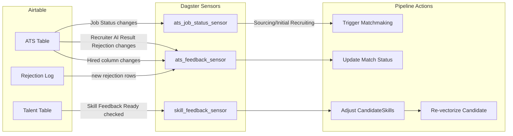

# Match Feedback & Skill Adjustment System

## Overview

This document describes how recruiter feedback flows from Airtable back into the pipeline to improve match quality over time. It covers two feedback paths:

1. **Not-a-fit rejection** — a matched candidate is not suitable for a job, and the reason should inform future scoring.
2. **Candidate skill adjustment** — a recruiter corrects or adds skills, ratings, or notes for a candidate based on interview/review findings.

Both paths use the existing Airtable ATS table columns and the Rejection Log table as input signals, detected by Dagster sensors.

---

## Airtable Columns Used for Feedback

### ATS table (`tblrbhITEIBOxwcQV`)

```
Potential Talent Fit AI          multipleRecordLinks → Talent
Recruiter AI Result Rejection    multipleRecordLinks → Talent
Feedback                         multilineText
Notes                            multilineText
Job Status                       singleSelect
```

### Rejection Log table (`tblUEdOtvNLESH3Fz`)

```
Talent                           multipleRecordLinks → Talent
Job                              multipleRecordLinks → ATS
Stage                            singleSelect: Introduction | Interview | Assignment
Outcome Type                     singleSelect: Rejected | Role Closed | Role On Hold | Job On Hold
```

### Talent table (`tblOkLOSo4Zjwp0yF`)

Existing columns relevant to feedback:

```
(N) Skills Summary               multilineText (pipeline-written)
Skills                           multipleSelects (manual Airtable field)
Internal Notes                   multilineText
Comment about Talent (by Mert)   multilineText
Comment about Talent (by Angad)  multilineText
Comment about Talent (by Boosik) multilineText
```

---

## Feedback Path 1: Not-a-Fit Rejection

### How it works in Airtable

1. After matchmaking, `Potential Talent Fit AI` on an ATS record contains linked Talent records (the AI-proposed candidates).
2. A recruiter reviews the proposed candidates. For any candidate that is not a fit, the recruiter **drags the candidate chip from `Potential Talent Fit AI` to `Recruiter AI Result Rejection`** (or removes from the AI column and adds to the rejection column).
3. Optionally, the recruiter writes a reason in the `Feedback` or `Notes` field on the ATS record. Or they create a row in the Rejection Log table with `Stage = Introduction` and `Outcome Type = Rejected`.

### What the sensor does

A new `ats_feedback_sensor` polls the ATS table periodically (every 5 minutes). For each ATS record:

1. Read `Recruiter AI Result Rejection` to get the list of rejected Talent record IDs.
2. Compare against a cursor of previously-processed rejections for this ATS record.
3. For each newly rejected candidate:
   - Look up the `Match` row in Postgres by (candidate_airtable_record_id, job_partition_key).
   - Update `Match.status` to `REJECTED` and store the rejection timestamp.
   - If `Feedback` or `Notes` text is present on the ATS record, store it in `Match.reviewer_notes`.

### How this improves future matching

Rejection signals are stored in the `matches` table with `status = REJECTED`. Over time, this data enables:

- **Scoring weight tuning:** Analyze which score components (role similarity, skill fit, compensation, etc.) are highest on rejected matches vs. hired matches. Adjust weights to de-emphasize misleading signals.
- **Negative example filtering:** When computing matches for future jobs from the same company, de-prioritize candidates who were previously rejected by that company.
- **Rejection reason clustering:** If `reviewer_notes` contain patterns (e.g., "not enough Solana experience", "salary too high"), these can be extracted and used as additional filtering criteria.

### Data model

The existing `Match` model already has the fields needed:

```python
class Match(Base):
    status: MatchStatusEnum  # MATCHED → REJECTED / REVIEWED / HIRED
    reviewer_notes: str | None
    reviewed_by: UUID | None
    reviewed_at: datetime | None
```

`MatchStatusEnum` already includes: `matched`, `reviewed`, `contacted`, `rejected`, `hired`.

No schema migration is needed for basic rejection tracking.

---

## Feedback Path 2: Candidate Skill Adjustment

### The problem

The LLM normalizes candidate skills from CVs, but:
- It may miss skills the candidate actually has (not mentioned in CV but discovered in interview).
- It may overrate skills the candidate claimed but couldn't demonstrate.
- Recruiters or technical evaluators learn things about candidates during the hiring process that should feed back into the candidate profile.

### How it works in Airtable

We add new columns to the **Talent** table for skill feedback:

| Column Name | Type | Purpose |
|---|---|---|
| `(F) Skill Feedback` | multilineText | Structured skill adjustment instructions. Format: one line per adjustment. |
| `(F) Skill Feedback Ready` | checkbox | Recruiter checks this when feedback is ready to be processed. |
| `(F) Skill Feedback Notes` | multilineText | Free-form context about why skills were adjusted (for audit trail). |
| `(F) Last Feedback Processed` | dateTime | Timestamp of last processed feedback (written by pipeline). |

The `(F)` prefix (for "Feedback") keeps these visually grouped and separate from the `(N)` normalized columns.

### Feedback format

The `(F) Skill Feedback` field uses a simple line-based format that recruiters can type directly:

```
+ Anchor Framework, 8, "Built production Anchor programs in interview"
+ Move Language, 6
- Solidity
~ TypeScript, 9, "Demonstrated deep TS knowledge in live coding"
~ React, 4, "Struggled with hooks in assignment"
```

**Syntax:**
- `+ Skill Name, rating, "optional note"` — **Add** a skill (or update if exists) with given rating (1-10).
- `- Skill Name` — **Remove** a skill entirely from the candidate's profile.
- `~ Skill Name, new_rating, "optional note"` — **Adjust** an existing skill's rating.

If no rating is provided for `+`, default to 5. If the skill already exists for `+`, update the rating.

### What the sensor does

A new `skill_feedback_sensor` polls the Talent table for records where `(F) Skill Feedback Ready` is checked.

For each flagged record:

1. Read `(F) Skill Feedback` text.
2. Parse each line into skill adjustments.
3. For each adjustment:
   - **Add (`+`)**: Call `get_or_create_skill(session, skill_name)` to resolve the skill ID. Upsert a `CandidateSkill` row with the given rating and the note as `notable_achievement`.
   - **Remove (`-`)**: Delete the `CandidateSkill` row for this candidate + skill.
   - **Adjust (`~`)**: Update the `CandidateSkill.rating` and optionally `notable_achievement`.
4. Set `(F) Last Feedback Processed` to current timestamp.
5. Uncheck `(F) Skill Feedback Ready`.
6. Clear `(F) Skill Feedback` (or leave it as audit trail — configurable).

### Re-vectorization after skill changes

Skill changes affect the candidate's `skill_*` vectors. After processing feedback:

1. The sensor yields a `RunRequest` for the `candidate_vectors` job for the affected candidate partition.
2. This re-generates the candidate's skill vectors using the updated `CandidateSkill` data.
3. Future matchmaking runs will use the corrected vectors.

### Alternative: Simpler approach without custom syntax

If the structured syntax is too complex for recruiters, a simpler approach:

1. Recruiter writes free-form text in `(F) Skill Feedback`: "Add Anchor Framework (strong, built production programs). Remove Solidity. TypeScript should be 9/10."
2. An LLM operation parses this into structured adjustments.
3. The sensor calls the LLM, then applies the parsed adjustments.

This trades LLM cost for usability. At ~$0.002 per parse, it's negligible.

---

## Feedback Path 3: Positive Outcome (Hired)

### Signal

When the ATS `Job Status` changes to `Hired` and a candidate is in the `Hired` linked record column:

1. The `ats_job_status_sensor` detects the status change.
2. Look up which candidate is in the `Hired` column.
3. Update the corresponding `Match` row: `status = HIRED`, `reviewed_at = now()`.

### Value

Hired outcomes are the strongest signal for algorithm quality. By tracking which candidates were actually hired:

- We can measure precision: what % of top-N candidates end up hired?
- We can identify which score components best predict hires.
- We can compute a "hit rate" per algorithm version.

---

## Feedback Path 4: Stage Progression Signals

Beyond binary hired/rejected, the ATS table tracks intermediate stages. Each stage transition is a signal:

| Transition | Signal strength | Meaning |
|---|---|---|
| AI Proposed → Shortlisted | Weak positive | Recruiter thinks the match has potential. |
| Shortlisted → Client Introduction | Medium positive | Good enough to show the client. |
| Client Introduction → Interview | Strong positive | Client wants to interview. |
| Interview → Hired | Strongest positive | Confirmed great match. |
| Any stage → Rejection column | Negative | Match didn't work at that stage. |

### Recording stage progression

The `ats_feedback_sensor` can track candidate movement across columns. On each tick:

1. For each ATS record, read all candidate-stage columns.
2. Compare against cursor (previous state).
3. For candidates that moved to a new stage, update `Match.status` accordingly:
   - Shortlisted → `REVIEWED`
   - Client Introduction → `CONTACTED`
   - Interview → `CONTACTED` (or a new `INTERVIEWING` status)
   - Hired → `HIRED`
   - Any rejection column → `REJECTED`

This requires adding the intermediate statuses to `MatchStatusEnum` if desired, or keeping it simple with the existing enum values.

---

## Sensor Architecture



### Sensor polling intervals

| Sensor | Interval | Rationale |
|---|---|---|
| `ats_job_status_sensor` | 300s (5 min) | Status changes are infrequent. |
| `ats_feedback_sensor` | 600s (10 min) | Rejections don't need instant processing. |
| `skill_feedback_sensor` | 900s (15 min) | Skill feedback is occasional; re-vectorization is expensive. |

---

## New Airtable Columns Needed

### On the Talent table (created via script)

| Column | Type | Purpose |
|---|---|---|
| `(F) Skill Feedback` | multilineText | Skill adjustment instructions from recruiter. |
| `(F) Skill Feedback Ready` | checkbox | Recruiter checks when feedback is ready. |
| `(F) Skill Feedback Notes` | multilineText | Context for the adjustments. |
| `(F) Last Feedback Processed` | dateTime | When pipeline last processed feedback. |

### On the ATS table (already exist)

No new columns needed. The following existing columns are used:
- `Potential Talent Fit AI` (write matches)
- `Recruiter AI Result Rejection` (read rejections)
- `Job Status` (trigger sensor)
- `Feedback` (read rejection reasons)
- `Hired` (read hire outcomes)

---

## Implementation Order

### Phase 3a: Not-a-fit rejection (simplest feedback)

1. Add `ats_feedback_sensor` that reads `Recruiter AI Result Rejection`.
2. Update `Match.status` to `REJECTED` for newly rejected candidates.
3. Store `reviewer_notes` from ATS `Feedback` field if present.

### Phase 3b: Hired outcome tracking

1. Extend `ats_feedback_sensor` (or `ats_job_status_sensor`) to detect `Hired` status + `Hired` column.
2. Update `Match.status` to `HIRED`.

### Phase 3c: Skill feedback

1. Create script to add `(F)` columns to Talent table.
2. Add `skill_feedback_sensor`.
3. Implement feedback parser (structured syntax or LLM-based).
4. Trigger re-vectorization after skill changes.

### Phase 3d: Stage progression tracking (optional, deferred)

1. Extend `ats_feedback_sensor` to track all candidate-stage columns.
2. Update `Match.status` as candidates progress.
3. Build analytics on stage conversion rates per algorithm version.

---

## Summary of Code Changes

| Area | File(s) | Change |
|---|---|---|
| Feedback sensor | `talent_matching/sensors/ats_sensor.py` | `ats_feedback_sensor` — reads rejections and hires from ATS |
| Skill feedback sensor | `talent_matching/sensors/ats_sensor.py` | `skill_feedback_sensor` — reads `(F) Skill Feedback` from Talent |
| Skill parser | `talent_matching/utils/skill_feedback_parser.py` | Parse `+`/`-`/`~` syntax into structured adjustments |
| Matchmaking resource | `talent_matching/resources/matchmaking.py` | `update_match_status()`, `apply_skill_adjustments()` |
| Definitions | `talent_matching/definitions.py` | Register new sensors |
| Setup script | `scripts/create_airtable_feedback_columns.py` | Create `(F)` columns on Talent table |
| Enum update | `talent_matching/models/enums.py` | Optionally add `INTERVIEWING` to `MatchStatusEnum` |
