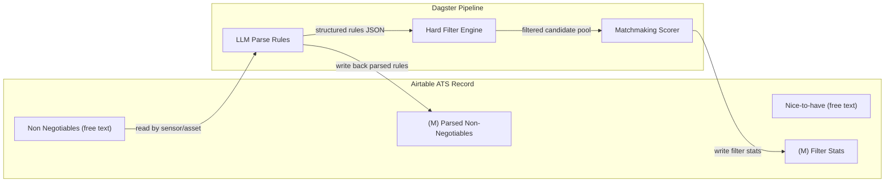

# Non-Negotiables: Hard Filter for Matchmaking

## Problem

The current matchmaking engine scores every candidate against every job. Must-have skills get 3x weight in the scoring formula, but a candidate missing all must-have skills still appears in the top 20 if their vector similarity is high enough. There is no hard filter -- no candidate is ever excluded.

This wastes recruiter time reviewing obviously unqualified matches and dilutes the quality of the shortlist.

## Goal

Allow recruiters to define **non-negotiable requirements** per job that act as hard filters. Candidates who fail any non-negotiable are excluded entirely from the scored pool -- they never appear in match results, regardless of how high their vector similarity or other scores might be.

Non-negotiables should be:
- **Flexible**: cover skills, location, experience, seniority, salary expectations, and arbitrary criteria
- **Easy to use**: a recruiter types natural language into an Airtable field; the system extracts structured rules
- **Auditable**: the parsed rules are visible (written back to Airtable or logged) so the recruiter can verify what the system understood

---

## Airtable Fields (Already Exist)

The ATS table (`tblrbhITEIBOxwcQV`) already has two relevant fields:

| Field | Type | Current Use |
|---|---|---|
| `Non Negotiables` | singleLineText | Recruiter notes about hard requirements |
| `Nice-to-have` | singleLineText | Recruiter notes about preferred-but-optional criteria |

These fields are currently free-text and not consumed by any automation.

### Proposed changes

1. **Upgrade `Non Negotiables` to multilineText** (via Airtable schema API) to allow multi-line input.
2. **Add `(M) Parsed Non-Negotiables` (multilineText)** -- the system writes back the parsed structured rules here so the recruiter can verify.
3. **Add `(M) Filter Stats` (singleLineText)** -- after matchmaking, write "X of Y candidates passed filters" so the recruiter knows the filter impact.

The `(M)` prefix (for "Matchmaking") groups these visually on the ATS record.

---

## How the Recruiter Uses It

The recruiter types natural language into `Non Negotiables` on the ATS record. Examples:

```
Must have Rust experience (at least 3 years)
Must be located in Europe or North America
At least 5 years of total experience
Seniority: Senior or above
Must have Solana or blockchain experience
Salary expectations must be under $200k
Must not be flagged as fraud
```

Or a more compact style:

```
Rust 3+ years, Solana experience required, Europe/NA only, senior+, <200k salary
```

Or even very specific:

```
Only candidates who have worked at a DeFi protocol before
Must have shipped production smart contracts
No candidates currently in an interview process with us
```

The system parses this into structured filter rules, writes them to `(M) Parsed Non-Negotiables` for verification, and applies them during matchmaking.

---

## Architecture



### Two-phase matchmaking

Current flow:
```
All candidates → Score all → Top 20 → Store matches
```

New flow:
```
All candidates → Hard filter (non-negotiables) → Score survivors → Top 20 → Store matches
```

The hard filter runs before scoring. Only candidates that pass all non-negotiable rules enter the scoring phase.

---

## LLM Rule Extraction

### Input

The `Non Negotiables` text from the ATS record.

### Output

A structured JSON array of filter rules:

```json
{
  "rules": [
    {
      "field": "skills",
      "operator": "contains",
      "value": "Rust",
      "min_years": 3,
      "description": "Must have Rust experience (at least 3 years)"
    },
    {
      "field": "location_region",
      "operator": "in",
      "value": ["Europe", "North America"],
      "description": "Located in Europe or North America"
    },
    {
      "field": "years_of_experience",
      "operator": ">=",
      "value": 5,
      "description": "At least 5 years of total experience"
    },
    {
      "field": "seniority_level",
      "operator": "in",
      "value": ["senior", "staff", "lead", "principal", "executive"],
      "description": "Senior or above"
    },
    {
      "field": "skills",
      "operator": "contains_any",
      "value": ["Solana", "Blockchain", "Smart Contracts", "Web3"],
      "description": "Must have Solana or blockchain experience"
    },
    {
      "field": "compensation_max",
      "operator": "<=",
      "value": 200000,
      "description": "Salary expectations under $200k"
    },
    {
      "field": "verification_status",
      "operator": "not_in",
      "value": ["fraudulent", "suspicious"],
      "description": "Not flagged as fraud"
    }
  ],
  "nice_to_haves": [
    {
      "field": "hackathon_wins_count",
      "operator": ">=",
      "value": 1,
      "description": "Has hackathon wins",
      "boost": 0.05
    }
  ]
}
```

### LLM Prompt

A new LLM operation (`talent_matching/llm/operations/parse_non_negotiables.py`):

```
You are a filter rule parser for a talent matching system. Convert the recruiter's
non-negotiable requirements into structured filter rules.

Available candidate fields you can filter on:

SKILLS (from candidate_skills table):
  - field: "skills" — candidate's skill names (resolved to canonical names)
  - operators: "contains" (has skill), "contains_any" (has at least one of these skills),
    "contains_all" (has all of these skills)
  - optional: "min_years" (minimum years of experience with that skill),
    "min_rating" (minimum proficiency rating 1-10)

LOCATION:
  - field: "location_country" — country name (e.g. "Germany", "United States")
  - field: "location_region" — region (e.g. "Europe", "North America", "APAC")
  - field: "timezone" — timezone (e.g. "UTC+1", "UTC-5")
  - operators: "in", "not_in", "equals"

EXPERIENCE:
  - field: "years_of_experience" — total years (integer)
  - field: "seniority_level" — one of: junior, mid, senior, staff, lead, principal, executive
  - operators: ">=", "<=", "==", "in", "not_in"

COMPENSATION:
  - field: "compensation_min" — candidate's minimum salary expectation (yearly, integer)
  - field: "compensation_max" — candidate's maximum salary expectation (yearly, integer)
  - operators: ">=", "<="

WORK HISTORY:
  - field: "job_count" — number of jobs held
  - field: "average_tenure_months" — average time at each job
  - field: "longest_tenure_months" — longest single tenure
  - field: "companies_summary" — list of company names worked at
  - field: "current_role" — current job title (text, use "contains" for substring)

EDUCATION:
  - field: "education_highest_degree" — e.g. "Bachelor's", "Master's", "PhD"
  - field: "education_field" — e.g. "Computer Science", "Mathematics"

VERIFICATION:
  - field: "verification_status" — one of: unverified, verified, suspicious, fraudulent

SOCIAL:
  - field: "github_handle" — GitHub username (use "exists" to require GitHub presence)
  - field: "social_followers_total" — total social media followers

DOMAIN (requires semantic check, not simple field filter):
  - field: "domain_experience" — free-text requirement matched against candidate profile
  - operator: "semantic_match"

Output a JSON object with "rules" (hard filters — candidate is excluded if ANY rule fails)
and optionally "nice_to_haves" (soft boosts — add a small score bonus if met, with "boost"
as a 0-1 float added to the match score).

Each rule has: field, operator, value, description (human-readable).
For skills: optionally min_years, min_rating.
For domain_experience: value is the domain description text.

If a requirement is ambiguous, prefer a looser interpretation (don't over-filter).
If you cannot map a requirement to any field, include it with field: "unresolved"
and operator: "manual_review" so the recruiter knows it wasn't applied.
```

### Cost

This is a single LLM call per matchmaking run. With GPT-4o-mini, the prompt + recruiter text + response is ~1000 tokens = ~$0.001. Negligible.

---

## Filter Engine

### Implementation

A new function in the matchmaking flow that takes the parsed rules and a list of candidates, and returns only the candidates that pass all rules.

```python
def apply_non_negotiable_filters(
    candidates: list[dict[str, Any]],
    candidate_skills: dict[str, list[dict]],
    rules: list[dict[str, Any]],
) -> tuple[list[dict[str, Any]], dict[str, list[str]]]:
    """Apply hard filter rules to candidates.

    Returns:
        Tuple of (passing_candidates, rejection_log).
        rejection_log maps candidate_id to list of rule descriptions that failed.
    """
```

### Operator implementations

| Operator | Fields | Logic |
|---|---|---|
| `>=` | years_of_experience, compensation_min, etc. | `candidate[field] >= value` (skip if field is None) |
| `<=` | compensation_max, job_count, etc. | `candidate[field] <= value` |
| `==` | seniority_level, location_country | `candidate[field] == value` |
| `in` | seniority_level, location_region, location_country | `candidate[field] in value` |
| `not_in` | verification_status, location_country | `candidate[field] not in value` |
| `contains` | skills, current_role, companies_summary | Skill name in candidate's skill list (case-insensitive, alias-resolved) |
| `contains_any` | skills | At least one of the listed skills present |
| `contains_all` | skills | All listed skills present |
| `exists` | github_handle, linkedin_handle | `candidate[field] is not None and candidate[field] != ""` |
| `semantic_match` | domain_experience | Deferred: use vector similarity threshold. For v1, skip (log as unresolved). |

### Handling missing data

When a candidate's field is `None` (e.g., `years_of_experience` not known):
- **Conservative approach (default):** Candidate **passes** the filter. Rationale: we don't want to exclude candidates just because we lack data. The scoring phase will penalize them via low scores.
- **Strict approach (opt-in per rule):** Candidate **fails** if the field is required. The LLM can add `"require_data": true` to a rule to enable strict mode.

### Skill matching with alias resolution

Skill filters use the same alias resolution as the scoring engine. If the recruiter writes "React" and the candidate has "ReactJS" (which is aliased to "React" in `skill_aliases`), the filter matches.

The filter engine calls `load_alias_map()` once and resolves both the rule's skill names and the candidate's skill names to canonicals before comparing.

---

## Integration with Matchmaking Asset

### Current `matches` asset signature

```python
def matches(
    context, normalized_candidates, candidate_vectors, normalized_jobs, job_vectors
) -> list[dict]:
```

### Updated flow

```python
def matches(
    context, normalized_candidates, candidate_vectors, normalized_jobs, job_vectors
) -> list[dict]:
    # 1. Load non-negotiable rules (from ATS record via matchmaking resource)
    ats_record_id = ...  # resolved from job partition key
    rules = context.resources.matchmaking.get_non_negotiable_rules(ats_record_id)

    # 2. If rules text exists but not yet parsed, parse via LLM
    if rules.get("raw_text") and not rules.get("parsed"):
        parsed = asyncio.run(parse_non_negotiables(context.resources.openrouter, rules["raw_text"]))
        # Write parsed rules back to ATS for recruiter verification
        context.resources.airtable_ats.update_record(ats_record_id, {
            "(M) Parsed Non-Negotiables": format_rules_for_display(parsed)
        })
    else:
        parsed = rules.get("parsed", {"rules": []})

    # 3. Apply hard filters
    all_candidates = _to_candidate_list(normalized_candidates)
    candidate_skills_map = context.resources.matchmaking.get_candidate_skills(...)
    filtered, rejection_log = apply_non_negotiable_filters(
        all_candidates, candidate_skills_map, parsed["rules"]
    )
    context.log.info(
        f"Non-negotiable filter: {len(filtered)}/{len(all_candidates)} candidates passed"
    )

    # 4. Score only filtered candidates (existing scoring logic)
    # ... existing code, but operating on `filtered` instead of `all_candidates`

    # 5. Write filter stats to ATS
    context.resources.airtable_ats.update_record(ats_record_id, {
        "(M) Filter Stats": f"{len(filtered)} of {len(all_candidates)} candidates passed filters"
    })
```

### Where rules are stored

**Option A: Parse on every matchmaking run** (simple, recommended for v1)
- Read `Non Negotiables` text from ATS.
- Parse via LLM.
- Write parsed rules to `(M) Parsed Non-Negotiables` for display.
- Apply filters.
- No persistent storage of rules in Postgres.

**Option B: Store parsed rules in Postgres** (for future analytics)
- Add a `non_negotiable_rules` JSONB column to `normalized_jobs`.
- Store the parsed rules after LLM extraction.
- The matchmaking asset reads from Postgres (no LLM call on re-runs unless text changed).
- Enables analytics: "which filter rules are most commonly used?"

Recommend **Option A** for v1 (simpler, rules change per run as recruiter edits text), with Option B as a future enhancement.

---

## Nice-to-Haves as Soft Boosts

The `Nice-to-have` field on the ATS record can be parsed by the same LLM call. Nice-to-have rules don't filter candidates out; instead they add a small score boost:

```json
{
  "nice_to_haves": [
    {
      "field": "skills",
      "operator": "contains",
      "value": "Move",
      "boost": 0.03,
      "description": "Experience with Move language is a plus"
    },
    {
      "field": "hackathon_wins_count",
      "operator": ">=",
      "value": 1,
      "boost": 0.02,
      "description": "Has hackathon wins"
    }
  ]
}
```

The boost is added to the candidate's final `match_score` (clamped to 0-1). This keeps the scoring composable: the main formula handles the bulk of scoring, and nice-to-haves are small nudges.

---

## Verification Display

The `(M) Parsed Non-Negotiables` field shows the recruiter what the system understood:

```
HARD FILTERS (candidates excluded if any fail):
  1. Must have skill: Rust (min 3 years) → filters on candidate_skills
  2. Location in: Europe, North America → filters on location_region
  3. Years of experience >= 5 → filters on years_of_experience
  4. Seniority in: senior, staff, lead, principal, executive → filters on seniority_level
  5. Must have any of: Solana, Blockchain, Smart Contracts, Web3 → filters on skills
  6. Max salary expectation <= $200,000 → filters on compensation_max
  7. Not flagged as fraud → filters on verification_status

SOFT BOOSTS (nice-to-have, adds score bonus):
  1. Has hackathon wins (+0.02 bonus)

⚠ UNRESOLVED (could not map to a filter):
  (none)
```

If any rules are unresolved, they appear with a warning so the recruiter knows to either rephrase or manually check.

---

## Edge Cases

### Empty non-negotiables
If `Non Negotiables` is empty, skip the filter phase entirely. All candidates enter scoring. This is the current behavior.

### Overly strict filters
If the filter eliminates all candidates, the system should:
1. Log a warning.
2. Still store 0 matches (don't fall back to unfiltered).
3. Write to `(M) Filter Stats`: "0 of 250 candidates passed filters. Consider relaxing non-negotiables."
4. The recruiter sees this and can loosen criteria.

### Conflicting rules
The LLM may produce contradictory rules (e.g., "must be junior" and "5+ years experience"). The filter engine applies all rules independently; if they conflict, no candidate will pass, triggering the "0 matches" warning above.

### Rules that change between runs
Non-negotiables are re-parsed from the current ATS text on every matchmaking run. If the recruiter edits the text between runs, the new rules apply. Previous match results (stored in Postgres) reflect the rules active at the time they were computed.

---

## Files to Add or Change

| Area | File | Change |
|---|---|---|
| LLM operation | `talent_matching/llm/operations/parse_non_negotiables.py` | New: LLM prompt + parser for non-negotiable rules |
| LLM init | `talent_matching/llm/__init__.py` | Export new operation |
| Filter engine | `talent_matching/utils/non_negotiable_filter.py` | New: `apply_non_negotiable_filters()` function |
| Matches asset | `talent_matching/assets/jobs.py` | Integrate filter step before scoring in `matches` |
| ATS resource | `talent_matching/resources/airtable.py` | Method to read `Non Negotiables` and `Nice-to-have` fields |
| Matchmaking resource | `talent_matching/resources/matchmaking.py` | Method to fetch non-negotiable text for a job |
| Mapper | `talent_matching/utils/airtable_mapper.py` | `format_rules_for_display()` helper |
| Setup script | `scripts/create_airtable_ats_matchmaking_columns.py` | Create `(M)` columns on ATS table |

---

## Implementation Order

1. **LLM operation**: `parse_non_negotiables.py` with prompt, JSON output parsing, and tests.
2. **Filter engine**: `non_negotiable_filter.py` with operator implementations and edge case handling.
3. **Integrate into matches asset**: add filter step before scoring, write filter stats back.
4. **ATS column setup**: script to create `(M) Parsed Non-Negotiables` and `(M) Filter Stats`.
5. **Test with real data**: run against a job with non-negotiables and verify filter behavior.
