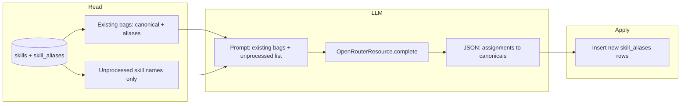

# Periodic skill normalization Dagster job

## Goal

A Dagster job that runs periodically (e.g. daily or weekly), processes **only skills that have not been processed yet**, uses **existing alias bags** in the prompt so the LLM **assigns** those unprocessed names to an existing bag (or marks as new group), then writes new rows to `skill_aliases` accordingly. **Processed** = skill is already in a bag (canonical or alias). **Unprocessed** = skill in `skills` but not yet in any bag. **Existing bags** = canonicals + their aliases from DB, passed into the prompt.

Note: OpenRouter is used via the existing **OpenRouterResource** (there is no separate “OpenRouter IO manager” in this project). The job uses that resource to send the prompt and parse the response.

---

## Job design

### 1. Data flow

### 2. Who is unprocessed

- **Existing bags:** For each skill row that has at least one row in `skill_aliases` with `skill_id = skill.id`, the bag is canonical (skill.name) + list of aliases for that skill_id. Collect all such bags.
- **Unprocessed skill names:** Skill names in `skills.name` that are not the canonical of any bag (no skill_aliases.skill_id points to that skill) and are not in any bag's aliases (no skill_aliases.alias equals that name). If there are no unprocessed names, the job can skip the LLM and apply steps (no-op run).

### 3. Ops / assets

- **Op 1: `get_existing_bags_and_unprocessed_skills`**
  - Uses DB session (e.g. `get_session` or matchmaking resource).
  - **Existing bags:** Query skills that have aliases; for each, get aliases for that skill_id. Build `list[dict]` with `canonical` (skill.name) and `aliases` (list of alias strings).
  - **Unprocessed:** Skill names that are neither a canonical (skill.id in skill_aliases.skill_id) nor an alias (skill.name in skill_aliases.alias). Return deduplicated list.
  - Returns: `{ "existing_bags": [ { "canonical": "TypeScript", "aliases": ["TS", "typescript"] }, ... ], "unprocessed_names": [ "Typescript", "ReactJS", ... ] }`. If `unprocessed_names` is empty, downstream can no-op.

- **Op 2: `assign_unprocessed_skills_to_bags`**
  - **Required resource:** `openrouter` (OpenRouterResource).
  - **Input:** `existing_bags` and `unprocessed_names` from Op 1.
  - **Prompt:** Include the existing bags in the prompt so the model assigns each unprocessed name to an existing bag (by canonical) or to new_groups. Instruct: use only canonicals from the existing bags; do not invent names. Example instruction:
    - Provide existing bags (canonical + aliases) and unprocessed names. Ask: for each unprocessed name, assign to an existing canonical if it means the same thing, else put in new_groups. Return JSON: assignments (skill_name, assign_to_canonical) and new_groups.
  - **Response format:** `response_format={"type": "json_object"}`. Expect shape: `{ "assignments": [ { "skill_name": "...", "assign_to_canonical": "..." } ], "new_groups": [ "..." ] }`. Return assignments and new_groups.

- **Op 3: `apply_skill_assignments`**
  - **Input:** `assignments` from Op 2; resolve canonical name to skill_id from existing_bags / DB.
  - **Logic:**
    - For each assignment (skill_name, assign_to_canonical), insert into skill_aliases (alias = skill_name, skill_id = that canonical skill id). Use upsert for idempotency.
    - For names in new_groups, optionally leave unprocessed for next run or create a bag with that name as canonical. Only process assignments; do not re-process names already in skill_aliases.

- **Job:**
  - Run: `get_existing_bags_and_unprocessed_skills()` → `assign_unprocessed_skills_to_bags(bags, unprocessed)` → `apply_skill_assignments(assignments)`. If Op 1 returns no unprocessed names, skip LLM and apply.
  - Assign **required_resource_keys**: `openrouter` and whatever you use for DB (e.g. a “db” or “matchmaking” resource that exposes a session, or call `get_session` inside the op).
  - Add the job to Definitions in [talent_matching/definitions.py](talent_matching/definitions.py).

### 3. Scheduling

- Add a **ScheduleDefinition** for this job (e.g. daily at 2am or weekly on Sunday).
- Register the schedule in Definitions so it appears in the Dagster UI and runs periodically.

### 4. Batching (if many unprocessed skills)

- If `len(unprocessed_names)` is large (e.g. > 1500), split the list into chunks (e.g. 200–300 names per request), call the LLM per chunk, then apply all assignments in Op 3; ensure assign_to_canonical refers to an existing bag canonical.
- Alternatively, run the job more often so the list stays smaller.

### 5. Idempotency and safety

- **Idempotency:** Op 3 should use “upsert” semantics for `skill_aliases` so re-running the job or re-running only Op 3 does not duplicate aliases.
- **Validation:** In Op 2, validate that each assigned canonical is in existing_bags and each skill_name is in unprocessed_names; ignore invalid entries.
- **Dry run:** Optionally add a run config or op output that returns proposed assignments without writing to the DB.

---

## Files to add or change

| Area | Action |
|------|--------|
| **LLM operation** | Add a function in `talent_matching/llm/operations/` (e.g. `normalize_skills.py`) that takes `(openrouter, existing_bags, unprocessed_names)` and returns parsed `assignments` and `new_groups`. Use `openrouter.complete(...)` with existing bags and unprocessed list in the prompt and `response_format={"type": "json_object"}`. |
| **Ops** | Add three ops: get existing bags + unprocessed names, call LLM to assign unprocessed to existing bags (or new_groups), apply assignments to skill_aliases. |
| **Job** | Define one `@job` that composes these ops and set `required_resource_keys={"openrouter", ...}`. |
| **Resources** | Reuse `OpenRouterResource`; ensure the job has access to the DB (e.g. via existing `matchmaking` resource or a thin `get_session` wrapper). |
| **Definitions** | Register the new job and schedule in [talent_matching/definitions.py](talent_matching/definitions.py). |
| **Schedule** | Create a `ScheduleDefinition` for the job and add it to Definitions. |

---

## Relation to the 3-day plan

- This **periodic job** can replace or supplement the “Day 2: LLM resolution at write time” in the skill normalization plan.
- **Recommendation:** Use this job as the primary way to build alias bags (periodic batch over all skills). Keep the **alias lookup** in `_get_or_create_skill` (Day 1) so that at write time we only do DB lookups (canonical + alias); no LLM in the write path. New skills that appear between runs will get a new row; the next run of this job can group them and create aliases.
- Optional: after applying alias groups, run a one-off or periodic “merge duplicate skills” step that consolidates multiple `skills` rows that are in the same group into one row and points all FKs to it.
