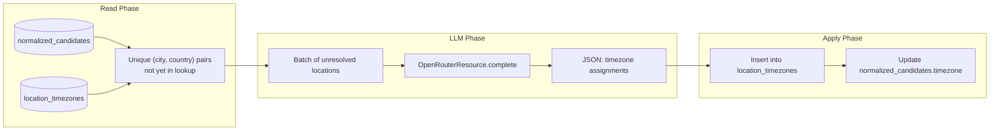

# Timezone Lookup Job

## Problem

Candidates have `location_city`, `location_country`, and `location_region` extracted by CV normalization, but the `timezone` field is unreliable. The CV normalization LLM guesses the timezone from whatever location text it finds in the CV, which often results in `null` (when the LLM isn't confident) or incorrect values (when a city maps to multiple timezones, or the LLM hallucinates).

Timezone data is valuable for matchmaking non-negotiables (e.g., "must be in US time zones") and for recruiter workflow (scheduling interviews across time zones).

## Goal

A **batch lookup system** -- similar to periodic skill normalization -- that:

1. Collects unique `(city, country)` pairs from all normalized candidates
2. Checks which pairs already have a resolved timezone in a lookup table
3. Sends unresolved pairs to an LLM in batches
4. Stores the results in a `location_timezones` lookup table
5. Backfills the `timezone` column on `normalized_candidates` from the lookup table

After the initial backfill, runs periodically to pick up new locations from newly ingested candidates.

---

## Data Model

### New table: `location_timezones`

```sql
CREATE TABLE location_timezones (
    id UUID PRIMARY KEY DEFAULT gen_random_uuid(),
    city TEXT,
    country TEXT NOT NULL,
    region TEXT,
    timezone TEXT NOT NULL,          -- IANA tz name, e.g. "America/New_York"
    utc_offset TEXT,                 -- e.g. "UTC-05:00" (for display / quick filtering)
    confidence TEXT DEFAULT 'high',  -- high | medium | low
    resolved_by TEXT DEFAULT 'llm',  -- llm | manual | geocoding_api
    created_at TIMESTAMPTZ DEFAULT now(),

    CONSTRAINT uq_city_country UNIQUE (city, country)
);

CREATE INDEX idx_location_tz_country ON location_timezones (country);
```

**Why a separate table instead of inline on candidates?**
- Many candidates share the same city/country. A lookup table avoids redundant LLM calls.
- The lookup table is reusable: job locations can also be resolved using the same table.
- Manual overrides (e.g., correcting a wrong timezone) fix it for all candidates from that location at once.

### Relation to `normalized_candidates`

The `timezone` column on `normalized_candidates` is the "applied" value. The job reads from `location_timezones` and writes to `normalized_candidates.timezone` where it's currently `NULL` or differs from the lookup.

No foreign key needed -- the join is on `(location_city, location_country)`.

---

## Architecture



---

## Job Design

### Op 1: `get_unresolved_locations`

Query unique `(location_city, location_country)` pairs from `normalized_candidates` that are not yet in `location_timezones`.

```sql
SELECT DISTINCT nc.location_city, nc.location_country
FROM normalized_candidates nc
LEFT JOIN location_timezones lt
  ON nc.location_city = lt.city AND nc.location_country = lt.country
WHERE nc.location_country IS NOT NULL
  AND lt.id IS NULL;
```

Also include `(NULL, country)` pairs -- when only the country is known, we can still resolve to the country's primary timezone.

Returns a list of `{"city": str | None, "country": str}` dicts.

If the list is empty, the job short-circuits (no-op).

### Op 2: `resolve_timezones_via_llm`

**Required resource:** `openrouter` (OpenRouterResource)

Send unresolved locations to the LLM in batches (up to ~200 locations per request to stay within token limits).

**Prompt:**

```
You are a geographic timezone resolver. For each location below, determine the
IANA timezone identifier (e.g., "America/New_York", "Europe/Berlin", "Asia/Tokyo").

Rules:
- Use the IANA Time Zone Database names (also known as Olson names).
- If a city is provided, use the city-specific timezone.
- If only a country is provided, use the country's most common/capital timezone.
- If a location is ambiguous (e.g., "Springfield" without a state), use the most
  populated match in the given country. Set confidence to "medium".
- If you cannot determine the timezone, set timezone to null and confidence to "low".
- For UTC offset, use the standard offset (not DST-adjusted).

Input locations:
{locations_json}

Return a JSON object:
{
  "results": [
    {
      "city": "Berlin",
      "country": "Germany",
      "timezone": "Europe/Berlin",
      "utc_offset": "UTC+01:00",
      "confidence": "high"
    },
    ...
  ]
}
```

**Model:** `openai/gpt-4o-mini` (timezone resolution is straightforward lookup-style knowledge, mini is sufficient and cheap).

**Cost:** ~200 locations per batch = ~500 tokens input + ~1000 tokens output = ~$0.001 per batch. For 1000 unique locations, that's 5 batches = ~$0.005 total. One-time backfill cost is negligible.

### Op 3: `apply_timezone_lookups`

1. **Insert into `location_timezones`:** Upsert each resolved result. On conflict `(city, country)`, update the timezone if the new confidence is higher.

2. **Update `normalized_candidates`:** For candidates whose `timezone` is NULL or whose `(location_city, location_country)` now has a lookup entry with a different timezone:

```sql
UPDATE normalized_candidates nc
SET timezone = lt.timezone
FROM location_timezones lt
WHERE nc.location_city = lt.city
  AND nc.location_country = lt.country
  AND (nc.timezone IS NULL OR nc.timezone != lt.timezone);
```

Also handle the country-only case:

```sql
UPDATE normalized_candidates nc
SET timezone = lt.timezone
FROM location_timezones lt
WHERE nc.location_city IS NULL
  AND nc.location_country = lt.country
  AND lt.city IS NULL
  AND (nc.timezone IS NULL OR nc.timezone != lt.timezone);
```

---

## Job Definition

```python
@job(
    resource_defs={"openrouter": openrouter_resource},
    description="Resolve timezones for candidate locations via LLM lookup",
)
def timezone_lookup_job():
    locations = get_unresolved_locations()
    resolved = resolve_timezones_via_llm(locations)
    apply_timezone_lookups(resolved)
```

### Scheduling

A `ScheduleDefinition` running daily (or weekly). The job is incremental -- it only processes new locations, so daily runs are cheap after the initial backfill.

```python
timezone_lookup_schedule = ScheduleDefinition(
    job=timezone_lookup_job,
    cron_schedule="0 3 * * *",  # daily at 3 AM
)
```

---

## Job Location Timezone Resolution

The same lookup table can resolve job locations. Normalized jobs have `location.locations` (a list of location strings) and `location.type` (remote/hybrid/onsite).

A future enhancement can:
1. Parse job location strings into `(city, country)` pairs
2. Look them up in `location_timezones`
3. Use this in non-negotiable filters: "candidate timezone must overlap with job timezone by at least 4 hours"

This is not part of the initial implementation but the lookup table design supports it.

---

## Edge Cases

### City is NULL, country is known
Resolve to the country's capital/primary timezone. For large countries (US, Russia, Canada, Australia), use the capital's timezone and set confidence to "medium". The recruiter-facing data shows the country, and the approximate timezone is better than nothing.

### Country is NULL
Skip -- we can't resolve a timezone without at least a country. These candidates will have `timezone = NULL` until their location data improves (e.g., via Airtable feedback).

### Ambiguous cities
"Springfield" exists in many US states. The LLM is instructed to pick the most populated match and mark confidence as "medium". If the city-level precision matters, the recruiter can manually override in the lookup table.

### LLM returns invalid IANA timezone
Validate the returned timezone string against `zoneinfo.available_timezones()` (Python 3.9+). Reject invalid entries and log them for manual review.

### Locations that change
If a candidate's location is updated (e.g., they move), the next run of the job will pick up the new `(city, country)` pair if it's not yet in the lookup table. The `UPDATE` query will apply the new timezone.

---

## Files to Add or Change

| Area | File | Change |
|---|---|---|
| Model | `talent_matching/models/location_timezones.py` | New: SQLAlchemy model for `location_timezones` table |
| Migration | `migrations/versions/xxx_add_location_timezones.py` | New: Alembic migration to create the table |
| LLM operation | `talent_matching/llm/operations/resolve_timezones.py` | New: LLM prompt + parser for timezone resolution |
| LLM init | `talent_matching/llm/__init__.py` | Export new operation |
| Ops | `talent_matching/ops/timezone_lookup.py` | New: three ops (get unresolved, resolve via LLM, apply) |
| Job | `talent_matching/jobs/__init__.py` | Register `timezone_lookup_job` |
| Definitions | `talent_matching/definitions.py` | Register job and schedule |

---

## Implementation Order

1. **Model + migration**: `location_timezones` table.
2. **LLM operation**: `resolve_timezones.py` with prompt, JSON parsing, IANA validation.
3. **Ops**: three ops following the pattern above.
4. **Job + schedule**: wire into Dagster definitions.
5. **Initial backfill**: run the job once to resolve all existing locations.
6. **Verify**: spot-check a few known cities against expected timezones.
